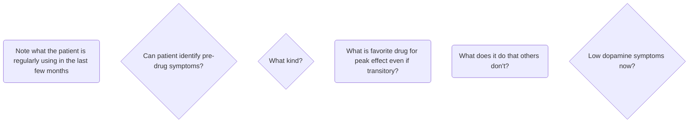

```mermaid
flowchart TB

regularly_using(Note what the patient is regularly using in the last few months)
can_identify{Can patient identify pre-drug symptoms?}
what_kind{What kind?}
favorite(What is favorite drug for peak effect even if transitory?)
what_does(What does it do that others don't?)
low_da{Low dopamine symptoms now?}

```
