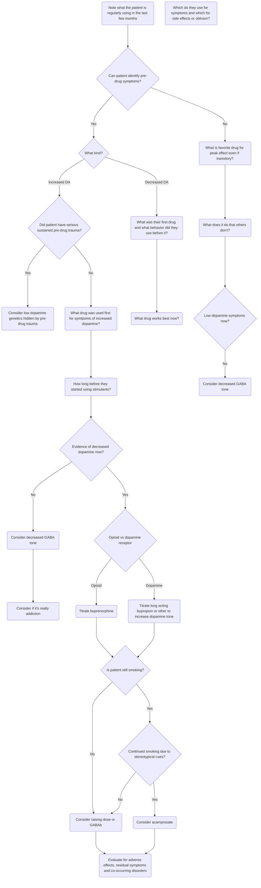

```mermaid
flowchart TB

regularly_using(Note what the patient is regularly using in the last few months)
can_identify{Can patient identify pre-drug symptoms?}
   regularly_using--->can_identify
what_kind{What kind?}
   can_identify--->|Yes|what_kind
   trauma{Did patient have serious sustained pre-drug trauma?}
      what_kind--->|Increased DA|trauma
      consider_low(Consider low dopamine genetics hidden by pre-drug trauma)
         trauma--->|Yes|consider_low
      what_drug(What drug was used first for symtpoms of increased dopamine?)
         trauma--->|No|what_drug
         how_long(How long before they started using stimulants?)
            what_drug--->how_long
            low_now{Evidence of decreased dopamine now?}
               how_long--->low_now
               gaba(Consider decreased GABA tone)
                  low_now--->|No|gaba
                  really(Consider if it's really addiction)
                     gaba--->really
   first_drug(What was their first drug and what behavior did they use before it?)
      what_kind--->|Decreased DA|first_drug
      works_now(What drug works best now?)
         first_drug--->works_now
         side_effects(Which do they use for symptoms and which for side effects or oblivion?)
favorite(What is favorite drug for peak effect even if transitory?)
   can_identify--->|No|favorite
   what_does(What does it do that others don't?)
      favorite--->what_does
      low_da{Low dopamine symptoms now?}
         what_does--->low_da
         op_vs_da{Opioid vs dopamine receptor}
            low_now--->|Yes|op_vs_da
               low_gaba(Consider decreased GABA tone)
                  low_da--->|No|low_gaba
            da(Titrate long acting bupropion or other to increase dopamine tone)
               op_vs_da--->|Dopamine|da
            op(Titrate buprenorphine)
               op_vs_da--->|Opioid|op
               still_smoking{Is patient still smoking?}
                  op--->still_smoking
                  da--->still_smoking
                  cues{Continued smoking due to stereotypical cues?}
                     still_smoking--->|Yes|cues
                     campral(Consider acamprosate)
                        cues--->|Yes|campral
                     raise_gaba(Consider raising dose or GABAb)
                        still_smoking--->|No|raise_gaba
                        cues--->|No|raise_gaba
                        other(Evaluate for adverse effects, residual symptoms and co-occurring disorders)
                           raise_gaba--->other
                           campral--->other


```
