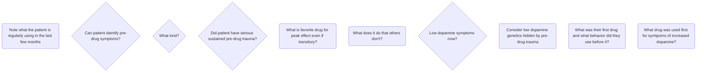

```mermaid
flowchart TB

regularly_using(Note what the patient is regularly using in the last few months)
can_identify{Can patient identify pre-drug symptoms?}
what_kind{What kind?}
   trauma{Did patient have serious sustained pre-drug trauma?}

favorite(What is favorite drug for peak effect even if transitory?)
what_does(What does it do that others don't?)
low_da{Low dopamine symptoms now?}
consider_low(Consider low dopamine genetics hidden by pre-drug trauma)
first_drug(What was their first drug and what behavior did they use before it?)
what_drug(What drug was used first for symtpoms of increased dopamine?)


```
