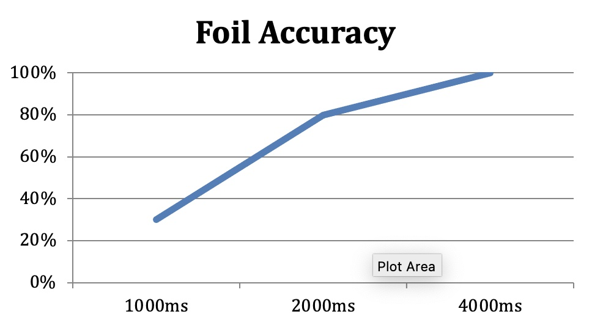
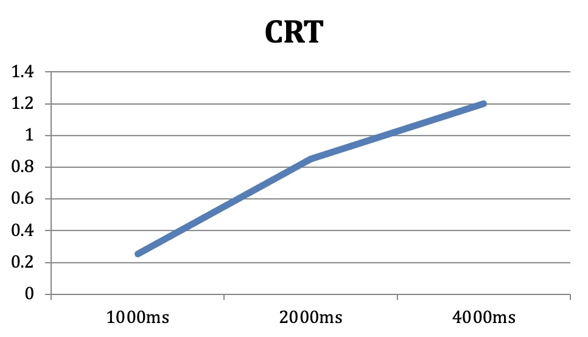
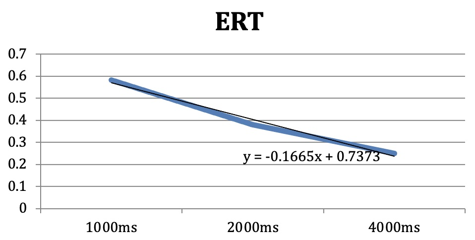
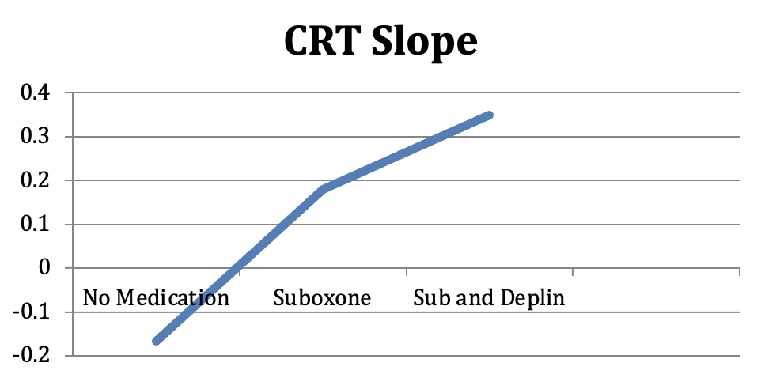
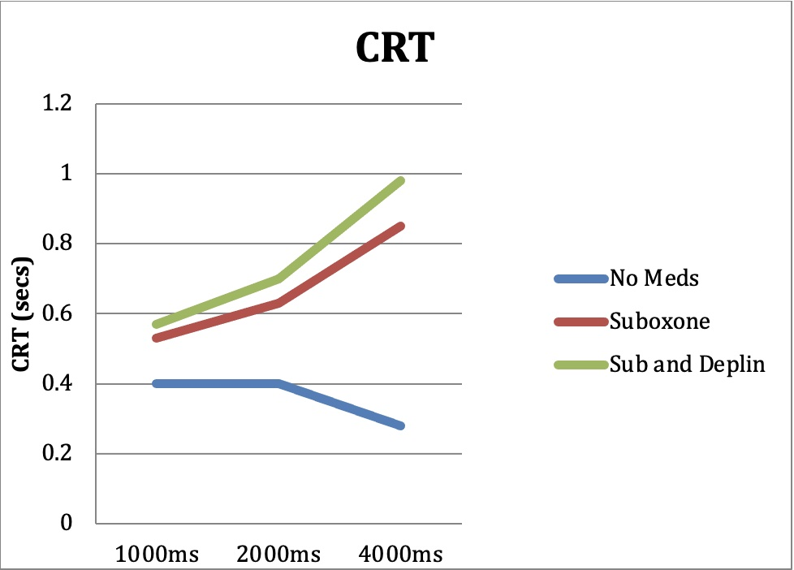

<h1>Neurocognitive Testing</h1>

 

 
### Iowa Gambling Task (IGT)

The IGT is a card task in which there are 100 pulls from 4 decks of cards. The
decks are turned face down, and each card has some amount of gain and some
amount of loss for the participant. The subject starts with $2000, and the
instructions to win as much money as possible. Here’s a screen shot of the IGT
implemented on treatment center’s portal:

Figure 11 - IOWA GAMBLING TASK

The subject is free to choose his next card from any of 4 decks. He presumably
picks based on his assessment of which card will give him the biggest win or the
smallest loss. Here, the subject has picked his first card, which resulted in a
reward of $100 and a penalty of $0:

Figure 12 - IGT PICK

The task measures a proxy of midbrain dopamine called reward overvaluation. In
nature, reward overvaluation is an important survival tool during hardship.
Imagine this example. If you were told that there was a free bag of groceries
across the street, wouldn’t you look both ways before going to get them? Now if
you hadn’t eaten in six days and were starving to death, do you think you’d be
as careful of the traffic? Reward overvaluation evolved to get us to go get the
source of dopamine when our dopamine is low. As low dopamine is a life and death
signal, it’s justified to ignore risk to get more. It’s as if the brain
calculates that, “Well, I’m going to die anyway, so I might as well go in that
dark cave where there’s food and if there’s a bear in there, I’ll just have to
kill it.” During times of greater plenty, who would take such a risk?

The result of the IGT is a single number. Normal brains gain money from the
starting $2000 and often double that. Brains low on dopamine generally lose
money. The test can be repeated as often as desired, and one can follow the
result in serial fashion to help gauge the effect of medication on midbrain
dopamine tone. Here’s a picture of the IGT results given in the treatment center
portal:

Figure 13 - IGT RESULTS IN TX CENTER PORTAL

In addition, the portal we built to support our methods also gives the doctor a
picture of the safe vs risky picks the patient had along with a running sum of
safe vs risky picks where a safe pick adds 1 and a risky pick subtracts 1:

Figure 14 - ADVANCED IGT RESULTS IN TX CENTER PORTAL

These enhancements can show patterns in thinking not available to someone just
using the single sum result. In this case you see the patient initially having
all risky picks until #19 and then he switches to a safe deck, gets quickly
bored within 6 picks and goes back to a risky deck. He starts a pattern of
several risky picks and then a safe pick through pick 55, has a brief run to
safety followed by a plateau and a resumption of increased risk to the end.
Different patients will produce different patterns that one can pick up with
experience.

Here’s an example of a patient that was started on Deplin after his second test:

Figure 15 - IGT COMPARISON BEFORE AND AFTER DEPLIN

There is one caveat. In clinical situations, one can have too high a dopamine
spike and rewards can become over-attaching even when one had normal dopamine
tone. For instance, someone with a high spike that doesn’t diminish with
increased dopamine tone. Sometimes a rising IGT that starts to fall can be a
sign that dopamine is too high, rather that too low. But generally, a low IGT
score will be a sign of low dopamine tone.

### Continuous Performance Task (CPT)

The CPT is a go/no-go task requiring the participant to do something every time
a specific signal is given and to refrain from doing that when a different
signal is given. In the specific CPT that we use, letters are projected on a
computer screen in block of time at one-, two-, or four-second intervals. The
patient is told to press the spacebar when any letter other than an “x” is
projected. However, when the patient sees an “x” he should refrain from hitting
the space bar. The letters are called targets and “x” is the foil. Here’s an
example of what a letter stimulus looks like on the Townsend portal:

Figure 16 - CONTINUOUS PERFORMANCE TEST SCREEN IN TREATMENT CENTER PORTAL

The stimuli come at three different frequencies: one-, two-, and four-seconds
apart. We measure 4 different variables for each set of time: target accuracy
(the percentage of times the person has hit the spacebar when he should), foil
accuracy (the percentage of time the person did not hit the spacebar when he
shouldn’t), correct response mean reaction time (the time between stimulus and
response for correct responses to targets), error response mean reaction time
(time from the stimulus to the response when the person commits an error). Note
that the correct mean response time (CRT) relates to targets and the error mean
response time (ERT) relates to the foils. So we have a grid of four measures at
three stimulus frequencies.

Table 11 - A Grid for Scoring the CPT

|Measure |	1000ms	| 2000ms |	4000ms |
|------|--------|--------|--------|
|Target Acc|   |    |    |
|Foil Acc|   |    |    |
|CRT|   |    |    |
|ERT|   |    |    |

Target Accuracy should always be greater than 90% or 0.9. The only cases we’ve
had of Target Accuracy being lower were when people did not understand the
directions either because they weren’t given correctly or because impairment was
so great that we shouldn’t have been testing them anyway. The only other cause
of lower than 0.9 Target Accuracy is an attempt to test poorly or “faking bad.”

Foil Accuracy should improve with time given to answer. It is normal for people
to make some commission errors at 1 sec intervals, but no one with normal
functioning should still hit the space bar in response to an “x” when they have
4 seconds to decide. Take the time yourself and see how long 4 seconds is. It’s
plenty of time to say, “Okay, that’s an x so I’m just going to wait.” One can
graph the Foil Accuracy over the time frequencies and the slope of the line
should be positive or flat if at 100% across the board.

 
Correct Mean Response Time will have to do with the targets. When foils are
handled correctly there are no response times as there are no responses, so CRT
only has to do with targets, not foils. In general people with normal dopamine
tone respond faster when they are given less time. The more time someone has,
the more they will take to get more accurate. CRT can also be graphed, and its
slope should also be positive.  A negative CRT slope means that when given more
time, the person is answering faster. This would be a sign of impulsivity. Some
low dopamine patients respond faster thinking the machine will speed up. This
negative slope can be seen as a sign of low midbrain dopamine tone.

 
Error Mean Response Time has to do with the foils. When targets are handled
incorrectly there is no response, hence no response time. In general, a poorly
sloped ERT curve will evidence the same mechanism as CRT but having to do with
foils instead. So, impulsivity is an issue, but so is frustration intolerance.
Imagine a person with low midbrain dopamine who is taking the test. The stimuli
are coming at every 4 seconds. This is a long time to wait. There is a
significant increase in frustration while waiting 4 seconds. An ERT negatively
sloped curve would be evidence of impulsivity and frustration intolerance. In a
normal person the ERT will be hard to slope because there will be no errors, and
therefore no error reaction time, at the 2 second and 4 second points. Below is
an example of the ERT curve of a low dopamine patient. Notice that the more time
the patient has, the faster he responds. This is paradoxical to what you would
expect in a normal person.

 
Repeated Testing can be done with the CPT, and it remains valid. We could watch
the change in accuracy and the change in slope of these graphs over time.  For
instance, notice that patient above evidences a slope of -0.167. We could follow
that over time as we instituted medication. Because ERT will not provide a slope
when there are no errors on 2 and 4 sec stimuli blocks, we would use CRT to
watch progress over time.

The above graph isn’t the slope of a single testing session. It is the result of
graphing the CRT slopes from 3 different sessions. We see that the patient
started with a negative slope and became positive after adding Suboxone. We also
note that when adding Deplin to his regimen he had an increase in his positive
slope. So, when he first came to treatment on no medications he was quite
impulsive, answering faster at 4 seconds than he did at 1 second. This reversed
to the normal pattern with the appropriate medication.

 
Another way to look at it would be to graph all three tests together such as
below.

You can see how a negative slope of CRT becomes positive over time with
medication changes.
