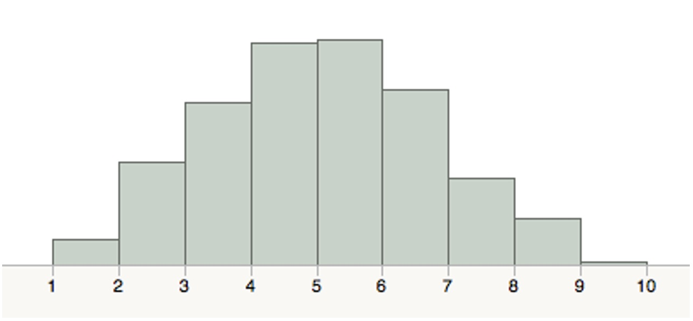

<h2>Special Topics in Biology</h2>

 
### Definitions

By the time we learn to use words to describe things like medical interventions
or public policy we’ve heard most of the words in other contexts, and we have
our own idea of what they mean. Long before we heard the word “addiction” in any
adult setting we heard it as children. It’s meaning to us reflects our oldest
understanding of the word. That is, we learned what we think addiction is long
before we learned about what it really is.

Most people I talk to about addiction are talking about something else. They are
talking about drug taking, or substance abuse or criminal behavior or just being
bad. They are talking about will and decision, self-deception and lying. To be
sure all these things can be associated with addiction, but none of them are
addiction.

It is important to separate out the core phenomena of the illness called
addiction from the surrounding epiphenomena that become associated with it. What
keep getting in the way are the definitions we use. Before we can actually
discuss what we have learned scientifically, we’re going to have to let go of
our old definitions of words that we think we know the meaning to. Addiction is
one of those words.

One colleague suggested that the word “addiction’ is so filled with false
meaning to people that we need a new word to mean the illness that we treat. I
came up with Subcortical Hedonic Attachment Syndrome, but there were two
problems. First, it didn’t quite capture everything that is core to addiction as
an illness and second, SHAS is a stupid sounding acronym.

So here are some definitions of addiction and related syndromes based on what I
see in nature. The things listed here that are biological can be mapped to
specific neurobiology. That informs treatment, as any diagnosis should.

**ADDICTION**: A permanent dysfunction of the midbrain reward system and
resulting hypo-frontality with characteristic symptoms relieved by using at
least one rewarding substance or behavior and resulting in the compulsive use
of that behavior.

Notice, it must be permanent; a temporary dysfunction brought about by combat,
domestic violence, or medication (like SSRIs) is not addiction even if
accompanied by attempts at self-treatment with rewarding substances. Note that
the hypo-frontality is secondary to the midbrain deficit. This is easily seen in
the neurobiology. Because it is secondary, treating the primary biology of
addiction best treats this hypo-frontality. The characteristic symptoms of
midbrain reward system dysfunction include irritability, frustration intolerance,
relative anhedonia, poor focus, poor memory, difficulty making attachments to
others, and procrastination. Compulsive use of some substance without these
symptoms would be a different syndrome. The substance or behavior must be used
to control and be effective in controlling or mitigating at least some of the
symptoms early on but may no longer do so late in the illness. Detailed history
on the reasons for former use may be necessary to understand the difference
between this and other syndromes. Use cannot be solely for oblivion from some
life situations, in response to external stressors or, in the case of anxiolytic
substances, for the control of anxiety caused by high dopamine tone.
(note: some patients use the term “anxiety” when referring to low dopamine
symptoms; the word itself is not enough to be exclusionary here)

**TEMPORARY REWARD SYSTEM DYSFUNCTION USE SYNDROME**: The temporary production
of symptoms of reward system dysfunction brought about by an environmental agent
or situation leading to the compulsive use of a rewarding substance, which
completely resolves with the removal of the causative environmental agent or
situation.

This will look like addiction clinically and will be differentiated from it by
history. Temporary Reward System Dysfunction Use Syndrome can become Addiction
with continued use and resulting damage to the midbrain reward system. Shame,
isolation, poverty, and the use of some medications such as SSRIs are some of
the things that can bring about temporary reward system dysfunction.

**COMPULSIVE USE SYNDROME**: The temporary compulsive use of a substance or
rewarding behavior brought about only in the aftermath of a rewarding stimuli
not accompanied by chronic symptoms of midbrain reward system dysfunction and
hypo-frontality.

This is behaviorally temporary as it is often seen as repeated binging episodes
and not present between episodes until triggered by another reward powerful
enough to cause a high and resultant crash leading to compulsive use. Between
episodes there are no symptoms of reward system dysfunction or hypo-frontality.
Compulsive Use Syndrome can become addiction with continued use and resulting
damage to the midbrain reward system. This would represent someone with only
Silkworth’s “allergy.”

**ANXIETY INDUCED SUBSTANCE USE**: The use, compulsive or otherwise, of any
anxiolytic substance, rewarding or otherwise, to quell the symptoms of anxiety,
even when done despite adverse consequences, coupled with an absence of symptoms
of midbrain reward system dysfunction.

Use must be solely for relief of anxiety and not for relief of symptoms of
midbrain reward system dysfunction. There must be no symptoms of midbrain reward
system dysfunction except in the immediate aftermath of a rewarding anxiolytic
substance. Anxiety induced substance use can become Addiction with continued use
and resulting damage to the midbrain reward system.

**SUBSTANCE OR REWARDING BEHAVIOR ABUSE**: The recurrent, non-compulsive use of
a substance, despite knowledge of possible adverse consequences, for purposes of
experimentation, fitting in with peers, to avoid social stigma or other social
reason without evidence of compulsive use, anxiety relief from use or symptoms
of midbrain reward system dysfunction.

Substance or rewarding behavior abuse can become addiction with continued use
and resulting damage to the midbrain reward system. This is the most commonly
envisioned cause of addiction in America but is only seen in the history of a
small minority of our patients coming for treatment.

**SUBSTANCE OR REWARDING BEHAVIOR USE**: The occasional, voluntary, and
non-problematic use of rewarding substances or behaviors in socially acceptable
situations without compulsive use, symptoms, or symptom relief.

If we use terms such as these when we discuss addiction, we will be driven to
measure it much differently. We’ll be forced to take a less behavioral and more
symptomatic approach to the problem. Because the symptoms are primary, this will
lead to a better set of interventions targeted at the cause rather than at the
result. The field and the patients could only benefit. 

## Addiction as Professional Wrestling

In the world of professional wrestling, everybody’s got a name. The name isn’t
just an identifier of person but also of personality: Edge, Tank Abbot, Ultimo
Dragon, etc. While most neuroscientists would shudder to think this,
neuroscience has the same convention. In the case of addiction, it’s always been
presented that The Cortex is battling The Midbrain.

The Cortex evokes thoughts of calm deliberation, executive control, and the
will. The Midbrain is the brain’s reward system and the seat of pleasure. Modern
psychiatry and neuroscience understand addiction in terms of The Midbrain
overpowering The Cortex when it’s The Cortex who should be champ. While I think
that’s a mistake, it is a vast improvement over what came before: The Cortex was
the only one in the ring.

Before modern neuroscience and the understanding of the brain biology of
addiction it was thought that addiction was a decision. Anyone who drank too
much was a normal person who chose to drink too much because they were selfish
and wanted more enjoyment than others had. There was no disorder; it was just
the will of a selfish or bad person.

Then along came psychiatry that understood neurosis and disorders of the cortex.
Addiction became understood as a disorder, but a disorder of a weakened cortex.
People who used drugs or alcohol were those who wanted to stop but couldn’t
because their cortex, the seat of decision making, was too weak. So, psychiatry
set about treating addiction as it did neurosis very early on. The answer was
psychotherapy. Unfortunately, it was a resounding failure, and people with
addiction were then seen as untreatable. Most of medicine and psychiatry
abandoned addicted patients at that point until the modern age of neuroscience.

Starting in the 1980s, discoveries were made that showed that the root pathology
of addiction lay in The Midbrain. Despite all these discoveries modern
neuroscience still has, as one target of addiction treatment, the idea of
somehow increasing the power of The Cortex so that people can decide to stop.
The corollary is that The Midbrain is too strong. It’s an interesting idea and
appeals to the concept of civilization taming the savage. Too bad it’s about as
real as professional wrestling.

It seems that when we had to give up the idea that addiction is an illness of
The Cortex and understand it as an illness of The Midbrain, we clung to the idea
that the fix would be to turn it into a problem of The Cortex, because we know
how to fix those. We really want this to become a matter of choice.

What’s always bothered me about this idea is that The Midbrain is designed by
nature to be stronger than The Cortex so any fix for addiction that makes The
Cortex stronger is like building a levee against a flood (I’m from New Orleans,
so you get my point about the eventual outcome). The Midbrain is the part of our
brain that makes us go get food when we haven’t eaten in 5 days. Even if The
Cortex says, “We really shouldn’t steal food from that old lady. It isn’t right.
It’s better to starve to death than hurt another person,” the Midbrain will just
laugh, and we’ll go get the food. If we weren’t designed that way, our ancestors
never would have survived.

So, it always bothered me from a philosophical position that the idea of making
The Cortex stronger was just human hubris, but I had no evidence. I think I do
now.

I recently received from a colleague the slides of a talk given some years ago
by Dr. Nora Volkow, director of the National Institute of Drug Abuse. She
pointed out in her slides the correlation between addiction and low density of
dopamine receptors in The Midbrain. That is, in addiction The Midbrain is
missing something. It’s not stronger; it’s missing something. She also noted
that in 1993[^40] and again in 2001[^41] her group published studies showing
that in cocaine “abusers” and methamphetamine “abusers” the lower the dopamine
density in The Midbrain the lower the function of The Cortex. That means it’s
the weakness of The Midbrain that causes the weakness of The Cortex. So, the
image of two wrestlers in opposition has to go away, and I’ll stop capitalizing
The Names.

It’s time for us to recognize that when we say addiction is an illness, we mean
it. It’s not in anyone’s control, and it isn’t going to be. There’s nothing we
have that will change it from being an illness of the midbrain to a problem of
the cortex. What that means is that someone with addiction will not be able to
fix his problem with his own thinking and medicine will not be able to make him
into someone who can fix his problem with his own thinking. That’s the essence
of AA’s first step that’s worked better for this problem than my field of
psychiatry has for over 70 years. As medicine grows in the knowledge in
neurobiology, we shouldn’t forget the wisdom gained in addiction treatment while
we were sitting on the sidelines.

## A Self-centering Illness

Addiction Medicine physicians are often faced with the self-centeredness of
people with addiction, as are most who deal with such people. It
immediately grates on one’s sense of what the interaction should be, and often
creates a defensiveness in us that keeps us from hearing what the person with
addiction is actually saying. Society looks at this self-centeredness and sees
willful selfish behavior, not illness.

So, the question is, is the self-centeredness of a person with addiction a mark
of unconscionable behavior, a personality trait that predisposes to addiction or
something else entirely? The first two have been long debated, as they are the
only two that were seen as possibilities without understanding the underlying
biology of the illness. Without modern scientific understanding (that is, left
with only society’s observations or the observational definitions in the
DSM) there is no way to understand an original biology that causes both addiction
and self-centeredness. So, any biological model of addiction must explain
self-centeredness. I think the known biology does.

If we accept that the biology of addiction is often created genetically or
environmentally early in life, and we accept that this biology is best
characterized by the effects of a lowered dopamine tone in the reward center, we
can begin to understand that the illness begins before the first external drug
and has a discrete set of symptoms other than drug use. The train of effects of
not having enough dopamine tone in the reward center is that there is not a
signal of wellbeing to a part of the brain’s cortex (insula) that is set up to
calculate the state of “wellness.”  It is related to another part of the cortex
(cingulate) that seems to calculate the need for behavioral reaction to the lack
of “wellness.”  This circuit seems to function in its natural state, not for
determining when we need more cocaine, but to tell us when we should act to
protect ourselves. It is, in short, a survival mechanism.

As all survival mechanisms, it is unconscious and automatic. It drives behavior
at a deep level regardless of what we “think” we ought to do. It should be noted
that this circuit doesn’t drive us to ask for help, it drives us to act in our
own self-interest. Survival mechanisms wouldn’t do much good for the organism if
they required thought, or politely asking for help from other organisms.

In most people this circuit only drives behavior in dire circumstances such as
famine, war, natural disaster, etc. But in some who have a lowered dopamine tone,
this circuit will be active all the time. If the lowered dopamine tone starts
early and is life-long, this drive to act to protect oneself will become
ingrained in the person’s repertoire of behaviors. They will act, most of the
time, as if their wellbeing depended on their own ability to solve the situation
or problem. They will, by necessity, center their behavior and attention on
their own needs as those needs are signaled as paramount by their biology.

This hypothesis is testable, I believe. If I am correct, we will see more
self-centeredness in people who develop the symptoms of addiction early than in
those who develop it late in life. And, in fact, that's what we see. It's clear
from Cloninger's work that such is the case. Many other researchers have noted
age of onset of addiction to vary with personality style and the more self-
centered styles are associated with earlier age of onset.

 
## If Addiction Could Only Talk

It would be nice if addiction could talk, or rather, speak in a language we
could understand clearly. It would be great if it would just say, “Excuse me,
I’m a little low on dopamine tone, please see your doctor for this problem.”
Even a dashboard light would be enough, maybe a little red LED under our
thumbnail that would light up to tell us we need professional attention. It
would be nice, but it doesn’t happen, so we’ll probably have to learn the
language addiction does use: symptoms.

Symptoms, I’ve found, come in two varieties. The first are primary (sorry, no
pun intended) symptoms directly caused by the neurobiology of lowered dopamine
tone in the midbrain reward system. The second are secondary (there I go again)
symptoms caused either by secondary neurobiological changes or that are learned.
I’ll give examples of the primary and secondary neurobiological symptoms I
usually see but it’s the learned symptoms I want to get into in greater depth.

I’ve mentioned elsewhere what the primary symptoms are: poor attention, poor
memory, inability to attach to others, relative anhedonia, restlessness, and
feeling like there’s something missing or we don’t have enough. These cause
secondary symptoms directly from the neurobiological changes or by the way we
interpret them and translate them into our social and family environment.
Examples of secondary biological symptoms are low motivation, feeling inadequate
and irritability. What I’d really like to spend some time on are the translated
or learned symptoms, basically what our brain learns to say to try to get the
message across.

If you think of the midbrain as someone who speaks a different language and the
cortex as a translator this may start to make a little sense. The midbrain
doesn’t speak English; it speaks Symptom. But the people around us who could be
of any help at all are all speaking English (at least in my case) so we try to
get the cortex to translate. How that translation sounds depends on a lot of
things. Age at onset of the disease, social background, cultural influence, and
family illness history are some but not all the influences on this translation.
Think about it this way. If you’re hearing Arabic translated into English, might
you not get a different translation from a native speaker than from someone who
learned Arabic as an adult. And might you get a different translation from
someone born in Indonesia than from someone born in Morocco? So, let’s take a
look at some of these factors and how they may change the translation we hear.

### Age at onset

What I mean here is not age of onset of drug use but age of onset of the primary
symptoms. Of course, that onset is usually followed immediately by frantic
efforts to raise dopamine tone but the first of these is rarely drug use if the
onset is in childhood. So, what would someone use to raise dopamine tone at the
age of three or four? An incomplete list includes foods high in sugar or fat,
getting someone to show us praise, novel stimuli, and feeling more powerful than
those around us. So those could get expressed as a sweet tooth, people pleasing,
thrill seeking, or bullying.

Of course, drug use does occur in very young children. I grew up with someone
who was exposed very early to paregoric, an opioid preparation that was used at
the time for colic and upset stomach in children. He very much liked the effect
produced by the paregoric and complained of intestinal problems a great deal. Of
course, his mother, not understanding he was asking for increased dopamine took
him to the pediatrician who didn’t understand he was asking for increased
dopamine and treated a spastic intestine that didn’t exist. The midbrain quickly
learned that when it needed more dopamine it should have a stomachache. More
about learned symptoms later.

As we lose dopamine tone with age, many people can get the symptoms after they
become an adult. By that time, they’ll have learned words that express some of
the events in the midbrain. They may be able to say they’re anxious or depressed.
They may be able to say their feeling “picked on” because they don’t have enough
of anything. In general, they’ll have more resources to express verbally what’s
happening in the midbrain, but, of course, they won’t be able to say, “Doctor, I
have a low dopamine tone in my midbrain.”

### Social Background

How could social status or background matter? Here’s one I’ve noticed. Most kids
who can’t pay attention well get pretty sick and tired of getting kicked around
for it. “Why can’t you do anything right?” “You never follow directions.” “Your
brother doesn’t leave his things laying around.” Who wouldn’t get sick of that?

So, kids react differently in different situations. The child of two
professionals who prize educational achievement above all else may learn to
compensate with obsessive neatness and note taking. If you can’t order your mind,
at least order your external world so you can’t forget much. The same child born
to a family that doesn’t prize education or that can’t afford to support the
obsessive reaction will have to develop a different strategy. That’s probably
why when I meet a low dopamine person who is obsessive, they are often from an
middle to upper economic background with highly educated parents. It has nothing
to do with the child’s intelligence or attributes; it’s just an epiphenomenon of
their social environment.

### Cultural Influence

Different cultures will allow different expressions of the symptoms. For
instance, that kid that had to have stomach cramps to get paregoric would have
had to find a different way in a more stoic culture or one that didn’t have
access to modern medication. Some cultures will allow the kinds of drugs that
kids in our culture can get early: caffeine, nicotine, sugar. Others will not
allow those drugs for children. Some behaviors will be acceptable and others
not. So, while the family is the basic unit of culture, the culture at large can
have an effect on the developing illness equal to or greater than that of the
family.

### Family Illness History

It’s probably easier to be an alcoholic if you grow up in an alcoholic home.
Your parents are more likely to see drinking as acceptable and you observe
people using alcohol to medicate their emotional state early on in your life.
However, family illness history doesn’t just predispose to the use of a
particular drug or behavior; in some cases it can protect against it. Another
boy I grew up with grew up in a home where his mother chain-smoked. He’s never
picked up a cigarette in his life, not because he had normal dopamine but
because he was so disgusted by his mother’s use of the drug. I can’t tell you
how many people I've met using heroin whose fathers were alcoholic while they
themselves never drank. They hated the idea of turning into their father and
thought if they only avoided his drug, they’d avoid the outcome. Of course, it
didn’t work like that but still that’s their thinking.

So, once you see addiction in terms of a biological brain disease you have to
start noticing things more subtle than what we usually term a drug. In the ADAM
Way we have identified 9 behaviors that can be used before the first use of a
drug as a dopamine raising behavior. In 966 admissions to my old treatment
centers’s IOP, we saw the following distribution of the number of behaviors
used before the first drug or alcohol intake. The average person used 5 of
these behaviors before the first use of a drug. None said they used no such
behavior before their first “drug.”

Figure 10 - PRE-DRUG BEHAVIORS USED TO RAISE DA TONE

I think this has important implications for treatment. Up to now, most treatment
programs have focused on “drugs or alcohol” to the exclusion of other drugs like
nicotine. So, a person with addiction may just leave treatment using a drug that
will progress his illness more slowly but still progress his illness. It also
affects “relapse” rates as we have seen.

While the issue of nicotine and, to some extent, sugar and overeating are
becoming more recognized in treatment programs, some of the earliest behaviors
are considered part of the patient’s underlying personality and not addressed at
all. I think we, as a field, would improve our service to our patients and
society if we addressed these early rewarding behaviors as drugs in treatment.
We’d get a more complete treatment and a more sober patient. This brings us to
some of the earliest “drugs” available and a discussion of DSM Axis II
personality disorders.

## DSM Personality Disorders

Osler said,
>"It's more important to understand what kind of patient has the
disease, than it is to understand what kind of disease the patient has."

If addiction is the illness we see in nature, that should be true with addiction
just like with it is with hypertension. A very ready typology exists to tell us
what type of patient has the illness of addiction, and it is the most common
typology used in the addiction treatment field: DSM Personality Disorders.
Unfortunately, it's not the right typology.

For any system to tell us about "what kind of patient has the disease," it must exist outside the illness. It must be a separate axis of measurement. That's the idea behind the various axes of DSM. It is believed that Axis I and Axis II have little overlap so that their juxtaposition would give increased information. However, concepts behind DSM personality disorders on Axis II and Substance Use Disorder on Axis I were both initiated in 1980 before the first description of the neurobiology of addiction by DiChiari in 1988. Therefore, Axis II needs to be reviewed in light of the neurobiology we've described.

The Axis II Personality Disorders are described as long-standing maladaptive sets of responding to the world that are hard to change even with therapy. They describe, in essence, what type of person, the patient is, but also that the patient is an extreme of this type. Personality disorders are not personality types; they represent an attachment to a limited repertoire of responses that the patient continues to use despite their lack of effectiveness and adverse consequences. That should give have been a hint right there. What else does DSM describe as an attachment to something in spite of the fact that it's causing harm and doesn't work anymore? That's right, Axis I Substance Use Disorder. Now that we understand addiction, as it exists in nature, not limited to substances, we must ask, "Do personality disorders represent addiction?" My answer is yes.

Let's try something to explore this. Get two books: the DSM and Alcoholics Anonymous. Open the DSM to the criteria set for any personality disorder except Schizotypal (which really belongs on Axis I) and open Alcoholics Anonymous to page 59, where the 12 steps are listed. Now we have to recognize that the personality disorder criteria are behavioral just like everything else in DSM; that is, when you stop behaving like those criteria, you don't have it anymore. Compare the criteria for the personality disorder to the behavior of someone living a life as described in the 12 steps. Is it possible to live those steps and still behave in a way to meet the DSM criteria? No, it's not. And my experience is that working the 12-steps does rapidly change behavior and personality structure even in someone who meets criteria for a personality disorder, while DSM says that the personality disorders are resistant to change. If this is not something you've seen with your own eyes, you won't believe me. That's okay. Let's look at it from a different angle.

We know that in people with low midbrain dopamine tone, certain behaviors can be rewarding. We've seen a partial list of them. One is power over others. Imagine what the life trajectory would be for a young boy born with low dopamine tone who can feel better when he has power over others. At first, the only times he feels better is when he has power over others. Then, as he ages, this is less effective. He starts to seek out other things that can more powerfully raise dopamine tone, like nicotine, and then alcohol. Remember what low dopamine tone does to risk/reward calculations. Remember how self-centering it is. Can you build a picture of such a boy growing up to meet the criteria for one of the DSM personality disorders? Of course, you can.

But so, what if you can? The personality disorders are hard to treat, right? What good will it do?

Perhaps we've seen them as hard to treat because we don't recognize them for what they are. Perhaps they feel so hopeless because they start so early that not even the patient remembers a time before they were there. It's hard to have hope in change if something has never been different. My experience, however, is that if the biology is explained to the patient, they can easily come to understand behaviors as rewards and more readily choose abstinence for those rewards, once given sufficient substitutes, just as they can for substances. So, my point is, not that it's easy to treat personality disorders, but rather that it's no harder than treating addiction, because the treatment is the same. So rather than an Axis II diagnosis being a reason why addiction treatment didn't work, as it commonly expressed in the treatment industry, it is a measure of the treatment center's misunderstanding of addiction and limitations in treatment. I find that resorting to Axis II diagnosis almost entirely precludes proper treatment for addiction because it leaves the oldest "drug" unrecognized, and this continual use of this reward will increase the chances of relapse onto others. It is a basic principle of the Townsend way to understand what would have been an Axis II personality disorder diagnosis as the earliest “drug” in the patient’s repertoire and not to label people with Axis II as an expression of their lack of response to treatment.

## Now About Sleep

It’s very common to have sleep problems in early recovery, and it is also very common for people with addiction to have had sleep problems all their lives. This has less to do with the past drug use than it does with brain functioning, so I’d like to explain a bit about that and how the addiction doctor can help.
In general, there are two kinds of sleep troubles: trouble falling asleep and trouble staying asleep. Trouble staying asleep is most often a direct result of not having enough dopamine tone in the midbrain. Dopamine is the “I have enough” chemical. Low dopamine is the same signal your body uses to tell you you’re in a famine and in a famine, you aren’t supposed to sleep soundly; someone may come and steal your apples. So, the patient’s ability to sleep soundly is an important biological marker that tells the physician when the medication prescribed has returned dopamine tone to normal. If one prescribes a sleep agent, the marker will be masked. It will be harder for the physician to know when the right dose of the medication has been reached.
Trouble falling asleep in addiction is generally not a nighttime problem; it’s a problem of the whole day. As we go through the day without vigorous recovery work, we accumulate little things here and there that play on our minds. As we’re busy and keeping ourselves distracted with day-to-day business, we don’t notice. When our head hits the pillow however, the distraction is gone, and all that stuff comes rushing back. So, the part of us that is keeping us awake can be thought of as the healthiest part that’s saying, “Hey, don’t go to sleep. We have recovery work left to do.” If you just lay there awake in bed, you’ll be practicing being awake in bed. Remember, you get more of whatever you practice. If you take a sleeping pill, you’re shutting up the healthiest part of you. Sounds like a lose/lose situation.
Instead, if you can’t fall asleep in 20 minutes or so, get out of bed, sit in a chair, and read the Big Book, Alcoholics Anonymous. Don’t read in bed, don’t read a novel or a magazine. One of two things will happen. You’ll either get tired and go to sleep – you win. Or you’ll get good recovery work done – you win. You may stay up all night reading the Big Book. I’ve given this advice to hundreds of patients and not one (who didn’t nap the next day) has ever told me he didn’t sleep the next night.
Of course, there are other causes of not sleeping besides addiction. Some are medical and associated with the brain and some are medical and not associated with the brain. Also, the normal human trauma response disrupts sleep and will generally pass in a few weeks if there are no reasons for it to become chronic. A chronic trauma response is common in people with addiction so it’s a big one to keep in mind. In general, the key is that not sleeping is a symptom of something else, not the main problem. It is a basic principle of the Townsend way not to merely treat the symptom of insomnia but to find and resolve the underlying disorder. 
Drug of Choice

When I think about it, there are few terms in the addiction treatment field that are sillier than “Drug of Choice.” As if we get to choose which drug makes the brain go “BAM.” When you talk to a person with addiction and ask, “What’s your drug of choice?” what you get is the answer to “What drug that is available to you lately at a price you can afford that makes you feel better with the least side effects?” Quite a mouthful, huh?
Would we ask a diabetic if their toxin of choice is sugar? How did they choose sugar? Why didn’t they choose to have an abnormal reaction to arsenic instead of sugar? What a stupid choice! Using the concept of choice, as in which would you choose if they were all lined up, can confuse us and strengthen the stigma and the idea that people with addiction are normal people who choose to use drugs. If we asked someone with addiction if they chose to have cocaine work the way it works with them or if they chose to have an abnormal reaction to alcohol, we’d hear a resounding “no.” “If I had the choice of what my brain reacted to I’d have picked something a lot cheaper and easier to get than cocaine,” something like wildflowers or dandelions, no doubt.
What is it we really want to know when we ask the question? And why? Well, up to now we really haven’t had a good reason. We just needed a word to write down in the “Drug of Choice” box on the assessment. In many cases it meant something, for instance when the person used only one drug. Most of the time however it doesn’t mean much with regard to choosing treatment. However, because researchers like things that come in boxes there has been a lot of research on “Drug of Choice.” It’s been used to predict treatment outcomes regarding which treatment is used. One example of such a research question would be, “Do alcoholics or opioid addicts do better when given naltrexone?” By dividing people up by “Drug of Choice” we manage to make one population (alcoholics), which is heterogeneous, sound different from another (opioid addicts) which is heterogeneous in a different and overlapping way with regard to neurobiology. It’s really no wonder most addiction research doesn’t make much sense.
But still insurance companies ask the question, and the government asks the question so we ask the question, as if we get to choose. But modern science gives us a new reason to ask a question about “Drug of Choice.” It’s just not the question we’ve been asking.
We don’t have many lab tests that we can use clinically in addiction medicine. It would be great if we had rapid, inexpensive PET scans that could predict something in individual patients instead of groups of subjects. But we don’t, at least not yet. In the meantime, we get to ask the patient about the drugs he’s used and with the knowledge of how those drugs work in the brain we can make some informed choices about which medications might help the patient. The problem is that people use the drug they use for a lot of different reasons, and we need to know those reasons as well for it to mean anything clinically.
For instance, we may ask a person if he likes to use cocaine. He says “no,” that he hates it. If we take it that far and no further, we think that cocaine doesn’t work for him and that a dopamine reuptake blocker such as bupropion wouldn’t work as a medication for him. But if we ask him why he doesn’t like cocaine, we may get more information. He may tell us he doesn’t like the crash or the paranoia, but that he can feel normal for about 10 minutes when he uses cocaine. If it was the only drug that worked for him, he’d use it but fortunately alcohol works as well and lasts longer so he drinks. It tells us first that he would likely do better on bupropion and second that he’s not likely to respond to naltrexone as some alcoholics do.
So we do need a question; it’s just not, “What’s your Drug of Choice.” It’s more like “What drug or drugs work to make your brain feel normal at the peak of the experience regardless of what side effects or time course may make you not like the experience in general.” You know, the DODWTMYBFNATPOTEROWSEOTCMMYNLTEIG. We need a shorter acronym; the government wouldn’t even use that one, and they thought up SAMHSA!
And while we’re at it we need a term that doesn’t make people think that people with addiction get to choose what makes them feel better. Cocaine doesn’t have a street value because a lot of people choose it; it has a street value because it works to make a lot of people with addiction feel normal for a brief period. When we use the word “choose” society gets the wrong idea and will come up with the wrong solution.
So we use the term, Most Effective Reward. It’s not limited to drugs and alcohol, it is focused biologically on the core problem, and it doesn’t imply conscious choice. There are still limitations. We must remember cultural aspects and economic availability. Just because someone’s most effective reward isn’t cocaine doesn’t mean that bupropion won’t work. They may have never been exposed to cocaine. But if we start thinking in terms of Most Effective Reward (MER) rather than Drug of Choice, we’ll likely take a more effective history and be able to be more effective in helping the patient.

## The Difference Between a Drug and a Medication

This is probably the second most important question in the field of addiction treatment, the first being whether addiction is an illness. I think it’s clear where I fall on the answer to that question, but once addiction is a illness, then comes the question of the role of medication in its treatment.
The field seems divided, but it’s always been divided. There have always been those that thought that any medication for someone with addiction would interfere with recovery, and while anti-depressants have largely become acceptable to this crowd, there are still a few who think even this is too much. This seems to stem from two ideas as far as I can tell. The first is the belief that “authentic suffering”  is required for true recovery and anything, even medication that blunts that suffering, will delay recovery. The other source seems to be the desire for “natural” recovery, I suppose stemming from the idea that it is the unnatural drugs that have caused the problem in the first place.
The second pole of the division is the group that has always advocated agonist maintenance treatment for addiction as a total treatment. This group seems based fundamentally on the need to restore biological function as the only goal of treatment. The idea being that the illness is purely physical and once it’s fixed the person is normal. Of course, there are many people in the middle, perhaps even most people, but these two poles seem to define the field.
I think these two groups have reached their opposite conclusions because of polar opposite views of the illness. The biological group sees a physiologic derangement that needs fixing. They historically have not paid enough attention to what happened to the person’s character structure during the years that the illness was active. The other group seems to be focused on the effect of the drug and gives little thought to the possibility of an underlying, even genetic, physiological derangement that caused the problem. With this background in mind, let’s look at how the two groups visualize drugs and medicine.
The “take no medicine” group sees any agent that acts at the same site or in a similar way to a drug as a drug and believes that it has no use in the treatment of addiction. The famous, or infamous, example of the day is Suboxone. It’s a partial opioid agonist and does what it does at the opioid receptor. Therefore, this group says it is an opioid and therefore anyone who takes it is not “clean.” While this view is not the mainstream, the belief system is influential and there are several treatment centers set up according to this philosophy.
The “medication is enough” group sees any agent that relieves suffering as a medication. It doesn’t matter where it’s used or if patients could use it as a drug, as long as some effort is made to limit its abuse. It doesn’t matter how it acts or how it relieves suffering. In the case of buprenorphine, this group responds enthusiastically to the ability to provide opioid (partial) agonist treatment in an outpatient setting, releasing them from the restrictions of the methadone clinic. Again, while this view is not the mainstream, the belief system is influential and there are several academic writers speaking about such “medication only” regimens. Their nod to psychosocial treatment has historically been to have a nurse call once a week to make sure the patient is taking their medication.
Of course, both groups are wrong and their errors are based on ignorance and fear. The “no medicine” group is afraid that doctors will just load people with addiction up with other drugs that will lead to similar if not larger problems in the future, not only delaying recovery but also doing actual harm. The medication only group is afraid that non-medical professionals will run the show requiring ideologies and belief systems of the patients and picking who lives and who dies according to who accepts the ideology of “the cult.” The examples that each group can site are real, but rare.
As in all things a middle path must be found. Townsend takes a middle path. Is our path any less of an ideology than the extremes? I hope so. The evidence that leads us to this path is in this book, and, hopefully, by now you are convinced.
For us a drug is what we use now to change how we feel now; it is the epitome of self will attempting to control nature. A medication is what one takes no matter how it makes one feel acutely because it is a treatment for an illness; it is the epitome of surrender to a fact of nature. Is there any role for drugs in recovery? We don’t think so. That means there’s no role for overeating, smoking, compulsive sex, compulsive exercise, compulsive gambling or spending, etc in recovery, because once we have the disease of addiction, we can use many if not all of those things as a drug. Is there a role for chemicals that act at the same site as some drugs? There can be. But to be medications they must be taken like medications. It is not usually the chemical in the medication that causes the problem but rather how it is used.
Medication is a tool, not a solution in the treatment of addiction. As long as both sides in the debate embrace the extremes, we will see continued problems and confusion for patients and other interested parties. A good topical example is buprenorphine. There is so much fear and hype around the medication that some doctors who are approved to use it refuse to write prescriptions for it because they are afraid of running afoul of the FDA or DEA. And it’s not so out of the question either. The federal government must be open to comments by all citizens and, unfortunately, some of them are presenting hype and fear. Government, even governments that strive to be data driven, can be driven by political pressure no matter how divorced from reality the source of the pressure is. I know professionals in the field who will not speak their mind at professional meetings for fear of peer reaction. The result is that hundreds die of overdoses of full opioid agonists because the “no medicine” group can find and present in hysterical fashion a few cases of buprenorphine abuse.
But often families and patients are quite worried about our starting a “drug” to treat addiction. We’ve developed a quick three-point test to ask the patient after they’ve started the medication. Ask them if, when they were taking their MER, they wanted more after they took it. When they say yes, hold up one finger. Ask them if their MER made them “high.” When they say yes hold up another finger. Ask them if it made them do things they later regretted. When they say yes, hold up a third finger. Now ask them if their medication is causing craving and the wish to take more and more medication. When they say no, withdraw a finger. Ask them if the medication makes them “high.” When they say no, withdraw a finger. Finally, ask them if, on the medication, they do stupid things they later regret. When they say no, withdraw the last finger. At this point I usually say something like, “Well your medication may work like an opioid in a test tube, but it doesn’t seem to work like an opioid in your body,” or the appropriate phrase if the medication is not buprenorphine. This usually works to calm fears of the medication. If the person is afraid before taking the medication, it is usually helpful to set up a trial by asking them if they’d trust our process for just a few days.

## How Much is Determined

We really want to be in charge. We really want to make decisions with our minds and have them be good ones. Even when we do things that are ineffective or downright stupid, we really want to say that we made the decision, that we were in charge. We worship the mind we make decisions with, and we abhor anyone who tells us that something about our decisions or choices is determined by biology.
I see this all the time in patients with addiction. Perhaps it’s just that they are socialized in a culture that is so focused on choice that they can’t accept that the disease is biological. Almost everyone I’ve met who came to treatment came to stop a behavior that they considered was a choice. Very few understood the actual biological nature of the unified illness until they were taught it. Most, when taught, saw it right away, but some fight the idea, holding on to the end to the idea that they make the choices and are in charge.
I read a study recently that illustrates the principle here even though it has nothing to do with addiction. Scientists at the University of Toronto  showed pictures of men’s faces to heterosexual women at various points in their ovulation cycle. Half the pictures were of self-identified gay men and half were of self-identified heterosexual men. They asked the women to pick which were the pictures of the heterosexual men.
A couple of points are illustrative. First, universally, all the women thought they did terrible at picking out the heterosexual men. No matter how close they were to ovulating or not, they felt that no one could do this. They couldn’t consciously find differences and, therefore, believed they couldn’t do it. The second point is that the closer the women were to ovulation the better they were at picking out the heterosexual men, an ability that fell off rapidly after ovulation.
Remember, these weren’t videos. There were no pheromones. There was no sound. They couldn’t interact with the men. The only thing they could do was look at facial photos.
Consciously, they had no idea that they could tell any difference. The part of the brain that they are aware of cannot do this, and so they didn’t think it was possible. It didn’t matter if the women wanted children or not. It had nothing to do with their wishes or their choices.
I’m going to leave aside all the other aspects of this study and just go over what it may mean for addiction. Obviously, the study needs to be replicated, but assuming the findings are real, this tells us something important.
First, our brain is active in areas we aren’t aware of. It’s making choices and judgments we aren’t privy to. There’s activity there that we can’t monitor or control with our cortex. If it can happen in this aspect of a woman’s brain it can happen in the reward center where addiction is active.
Second, our brains aren’t “hardwired” the way we think. There are, of course, genetic limits, but even those may be modified or compensated for by other behaviors. Our brains just aren’t as steady as we thought, they are plastic and changeable, and not necessarily the way we’d pick or chose them to be. It’s not just women who have cycles and not all cycles are monthly. Circadian cycles, annual cycles, multi-year cycles all exist, and, in addition, there’s aging. We can’t necessarily rely on our brain to be the same as it was yesterday, no matter how much we want it to be so.
So back to people with addiction. What do you do if you can’t trust your brain to make decisions or even to monitor decisions? There are several things that successfully recovering addicts have found over the years. First, don’t do it alone. A loving community of other recovering people can see things you can’t and know how to get you to see it. Second, you can’t change yourself by thinking differently; you must change your thinking by behaving differently. You just can’t decide that this time the drink won’t set you off; you must not take the first drink. Also, you can’t pick and choose which drugs are safe and which aren’t. Your reward system has already decided, and you weren’t invited to the meeting. Finally, you can’t direct your recovery yourself. You may come up with a brilliant plan based on all the best information, but if your cortex isn’t running the show, it’s not likely that your plan will work.
So how much is determined? Not everything, but a lot more than we thought, and a lot more than we are comfortable with.

 
## Monitoring Addiction vs “Physical Disease”

We are often confronted in this field with the idea that somehow addiction is less physical than other diseases. Nothing could be further from the truth, but it’s a common misconception. Perhaps a better way of stating the reality is that addiction is no more “mental” than other physical illnesses.
One of the ways the misconception is stated to me is that I somehow have less to go on with medical treatment than my colleagues that treat ailments outside of the brain. I’m having my own challenge with a condition right now that belies that. A couple of years ago I started to feel ill and it turned out I had a hiatal hernia, gastro-esophageal reflux (GERD). So, I was started on medication and did well. I evidently had also gotten some scarring on my vocal cord from the GERD, and this had to be attended to as well. The scarring didn’t improve after six months of medication, so the medication was changed, and I had to get off caffeine. I actually felt worse reflux on the new medication, so it was changed back to the old but at double the original dose. I still felt worse than I did on the original treatment that didn’t improve my vocal cord scarring.
What I noticed recently is the decision-making process of my doctor in all this. I’ve never had my esophageal reflux measured. They have no way to know if the reflux is better or just less acidic on the medication. They make decisions based on ideas such as caffeine makes reflux worse rather than on measuring if it makes it worse in me. There’s no profound knowledge of my specific physiology or genetics in these decisions. They seem to be made based on what has worked in studies that may, or may not, apply to me.
I don’t really see how theses ENT and GI doctors are really any better off than people who treat behavioral brain disease. Sure, they could measure the acid in my esophagus, but they don’t. It’s too expensive. I could measure someone’s dopamine release and baseline dopamine receptor availability, but I don’t; it’s too expensive. Okay, I had gastroscopy and they could see the esophagus was better with the medication, but how often can you do that? What tools do they have for ongoing monitoring that I don’t have? We both rely on the subjective reports of patients, and as a patient, I can tell you my subjective report is influenced by a lot more than the acid in my esophagus.
What we’re missing in addiction medicine is the same thing we’re missing in regular medicine, monitoring. Technology may improve this with cheaper monitors that are less intrusive and internal medicine will probably benefit before addiction medicine will, but right now you don’t see a lot of people running around checking their esophageal acid levels and learning on a day-to-day basis what helps and what doesn’t. If we could, the effect would be startling. Instead of saying to a patient, “don’t eat this” and “don’t do that,” we’d be saying, “how did that work?” Things would get a lot easier, and we wouldn’t be relying on subjective data. We might even find out that our long-held beliefs were wrong.
Here’s an example. My doctors told me that caffeine increases acid production and decreases the tension in the sphincter between the stomach and esophagus. Therefore, I need to stay away from caffeine, as it will make GERD worse. They learned this in school. However, in 1975, when they were in school, an article in the New England Journal of Medicine  showed that caffeine actually increased the tone of the sphincter. Old study you say? Here’s the abstract from another study from 1994.  It’s obviously from a commonwealth country. I really included it because I love they way they spell esophagus.
“Coffee and tea are believed to cause gastro-oesophageal reflux: however, the effects of these beverages and of their major component, caffeine, have not been quantified. The aim of this study was to evaluate gastro-oesophageal reflux induced by coffee and tea before and after a decaffeination process, and to compare it with water and water-containing caffeine. Three hour ambulatory pH-metry was performed on 16 healthy volunteers, who received 300ml of (i) regular coffee, decaffeinated coffee or tap water (n=16), (ii) normal tea, decaffeinated tea, tap water, or coffee adapted to normal tea in caffeine concentration (n=6, and (iii) caffeine-free and caffeine-containing water (n=8) together with a standardized breakfast. Regular coffee induced a significant (P<0.05) gastro-oesophageal reflux compared with tap water and normal tea, which were not different from each other. Decaffeination of coffee significantly (p<0.05) diminished gastro-oesophageal reflux, whereas decaffeination of tea or addition of caffeine to water had no effect. Coffee adapted to normal tea in caffeine concentration significantly (p<0.05) increased gastro-oesophageal reflux. Coffee, in contrast to tea, increases gastro-oesophageal reflux, an effect that is less pronounced after decaffeination. Caffeine does not seem to be responsible for gastro-oesophageal reflux which must be attributed to other components of coffee.”
So, it isn’t caffeine I should stay away from, it’s coffee. Interesting study but on a very small number of people. What would be the effect of thousands of people with real time measurements all submitting their data in real time with food and beverage intake? It would revolutionize the care of GERD. We need the same sort of thing in addiction medicine. I bet our old thoughts would be revolutionized as well.

## Addictive

I keep getting these emails from a company that wants to fix people’s receptors after “drug abuse.” Of course, they have an expensive proprietary treatment they’re selling. The latest missive is arguing against giving people, in or leaving prison, opioid agonist treatment if they are opioid dependent. One of the lines is, “However, many feel that putting someone who has already detoxed and had a period of abstinence from opioids on another potentially addictive opiate drug is a bad idea.” If you look up the word addictive, you’ll see that it implies causation of addiction. This really makes no sense unless you see addiction as an acute problem that is self-limited. If you see addiction as the chronic illness that it is, how can you give someone an illness they’ve already got?
To be fair, perhaps the writer understood that the opioid dependent prisoner is still addicted even though they are no longer on opioids and perhaps they were referring to reigniting the behaviors associated with addiction such as drug seeking. To be honest, I don’t think they did mean that, but let’s say they did. Still the facts don’t back them up. Study after study has shown an increased death rate when “detoxing” someone from opioid maintenance   . The data is so clear that the lack of medication is a bigger risk that prison systems around the world have begun looking at methadone and buprenorphine maintenance at release. Study after study has shown less craving, less drug seeking, less illegal behavior, less drug use, longer engagement in treatment and better treatment outcomes with the use of opioid agonist therapy.
In all other chronic diseases in medicine, we talk about remission and stability; never do we refer to giving the patient diabetes or hypertension again. They already have it. Only in the world of addiction treatment do we get confused between someone’s behavior and their illness state. I think this stems largely from the non-medical bias that we see in addiction treatment and in the rest of society’s reaction to addiction. We don’t treat addicts as if they were ill, but rather as if they were bad. This country has more people in jail per person than any other industrialized society in the world. Louisiana ranks number one in the country in inmates per person and the city that ranks number one in the state is where I live. Last year I heard from someone from the State prison system that told me that 65% of the inmates have addiction.
If we keep treating addiction like an acute problem that people will just get over when they’ve had enough pain, we’ll keep having the revolving door we’ve built in the criminal justice system. When we recognize the illness for what it is and institute the evidence-based practices that are effective we’ll start to get the society we want.

## Is Addiction a Spectrum Disorder

We all know what a spectrum is: one color on one end, another on the other end and a lot of transitions in between. The idea of illnesses being like a spectrum as opposed to dichotomous (has it or doesn’t) is gaining in mental health. Recently, in discussing changes for DSM-5, psychiatry’s diagnostic bible, it seems that those who are writing about the future diagnosis of substance use disorders are beginning to look at it as a spectrum. And, in fact, that’s where DSM 5 ended up. Sounds great. There’s only one problem with it; it doesn’t describe reality.
Making a spectrum out of the illnesses that have been put in the substance use category of DSM IV is like making a spectrum out of an apple, an orange, a lemon, a lime, a blueberry and a plum. You’d have the colors but your mixing different things. Sometimes a metaphor can be taken too far.
First there is the assumption that the substance use disorders hold together and are separate from other disorders in the DSM. It is an assumption and not one that is supported by the evidence of recent studies. DSM is concerned with behavior, not with biology. Illness is biology from which behavior can manifest, but it’s the biology that comes first. So, before we look at the substance use disorders and say they can be made into a spectrum we have to see if they are separate from other things that look like addiction (overeating, compulsive sex, compulsive gambling, etc.) and are the same as each other (that substance abuse is the same as addiction, only less of a problem).
The evidence I’ve seen suggests that it can’t be done. Biologically, addiction to opioids and addiction to sugar binging have more in common than addiction to opioids and abuse of opioids. There are a lot of reasons that people with normal brains choose to do stupid things with drugs, but there’s a real commonality about why people with addiction use. That commonality extends beyond drugs to anything that makes the reward system go “Bam.” When we try to put people with normal brains who abuse substances in addiction treatment, they don’t understand what we’re talking about. When we try to put people with addiction in treatment with people with normal brains they get confused and try to “use like a normal person.”
Next is the idea, inherent in the “spectrum” that there’s a real progression from lesser to greater levels of illness. Imagine a minor form of addiction that gets worse the more you use and becomes a greater form of addiction. There’s no doubt that addiction is progressive and progresses faster with drug use, but the question is does that mean it’s on a spectrum or just the same thing at a different point in the person’s life cycle? Diabetes follows the same sort of course, but you don’t see doctors calling diabetes a spectrum where non-insulin dependent is better than insulin dependent. In fact, that’s old thinking. Now we have endocrinologists trying to understand the underlying biology, poor insulin production vs insulin receptivity, and tailoring treatment to meet the underlying need, not just “how bad” the illness is.
With addiction it has been clearly shown that the criteria for “substance dependence” (addiction) show up sooner in terms of severity of illness than the criteria for “substance abuse” (not addiction) . So abuse isn’t some lesser form of the same thing that leads to a bigger form of the same thing. Actually, the evidence of that study comes from the same minds now trying to shoehorn the issue into a spectrum. Rather than taking the results of the study to question the very idea that addiction always follows abuse instead of being a separate entity, they are trying to salvage a drug-based definition system that has no biological basis.
When DSM-III first laid out the current nomenclature and diagnostic system it was 1981, 7 years before the first evidence for a common biological basis of addiction was discovered. It’s time to stop trying to prop up the old pre-scientific idea and ask what the data shows. That addiction is one disease and that there are different substances, including certain foods, or behaviors that are the focus of any given person’s illness and what “drug” the addicted person uses depends on what gives them the relief from a deficit in the reward system, not choice of drug.
Instead of trying to paint the pretty picture of spectrum, we should be looking at what the evidence says so we can provide the best care to patients with this chronic illness.
 

## What We Do When We’re Disturbed

Psychologists have a way of looking at emotion that is not like other people’s way, especially so with negative emotion. So, if you’re not a psychologist or psychiatrist this may seem a little weird.
Let’s say there is an emotion generation process; something happens and then this process takes over and out pops your emotion. It’s sort of like those old cartoons when you dump the raw ingredients on a conveyor belt that rolls them into a big black box, and like magic, the finished product comes out the other side. What goes in is our experience, and what comes out is our emotion. What goes on in the big black box is that emotion generation process.
So someone calls us a bad name, and we get angry. Why? We don’t know, something happened in that big black box, I guess.
Well psychologists have been looking in the box, and while they still haven’t figured out how it works, they have figured out what we do about it. They’ve outlined two strategies people use to change negative emotion. These are called “reappraisal” and “expressive suppression,” and they work at different points in the process. Reappraisal seems to work inside the black box somewhere and expressive suppression is like standing by the conveyor right outside the black box taking things off before they can be packed and shipped.
We’re all familiar with expressive suppression, at least those of us who live with other people are. That’s where you have a negative emotion, and you just hold it in or tell yourself you don’t feel it. We all also know how little it does to make things better.
But most people who haven’t been in cognitive therapy don’t know what reappraisal is so let’s look at that. Reappraisal has several steps. First you must recognize something happened and that you had a reaction. Second, you question your reaction. Third, you look at why you had the reaction, and fourth, you look at the underlying assumptions that led to your reaction. By the time you get that far, you’ve gone a long way to reappraising your reaction to whatever happened.
Of course, most people stop there if they get that far, and most people figure out they were right after all. But we could take it one step further. We could talk to someone else. Why? Because if we are unwilling to talk to another person, it’s probably because we used the reappraisal process to just fool ourselves into reinforcing the original assumptions. If we are willing to talk to another person, it’s much less likely that we’ve done that. And if we did, the other person has a shot at catching it and pointing it out to us.
Lest you think this all may sound nice but be completely made up I want to tell you about a study published a few years ago . In the study 17 women looked at video designed to either elicit a neutral or a negative reaction. They did this while either using either suppression or reappraisal. They were asked about their emotional experience and their facial expressions were videotaped. Both reappraisal and suppression decreased emotional behavior and experience. But here’s the kicker. They did the study with everyone’s head in a fast fMRI machine. The women who used reappraisal had very early (less than 5 seconds) response in their frontal cortex and decreased response in the amygdala (where emotional memory is stored) while those who used suppression had a late (10 to 15 seconds) response in the frontal cortex but increased response in the amygdala.
So using reappraisal seems to give us just as good a result faster and more permanently than suppression, which leaves all those negative emotional memories piled up in the amygdala. Well, why don’t we all just use reappraisal? Probably because suppression is easier; it doesn’t cost us as much effort. You get what you pay for.
Since I’m not writing this about psychology but about practicing addiction medicine, you’re probably wondering why I’m writing about this at all. It’s because the 4th and 5th step as outlined in Alcoholics Anonymous is as good an example of reappraisal as you’ll find anywhere, and you’re in a unique position to teach the patient about this. The more we practice it the quicker we get at it and as it becomes a second nature thing, it happens in seconds. Suppression is something we can do when we are not engaged in recovery. We can suppress alone, even when we are isolated. In fact suppression probably works better when no one is around to remind us of the garbage backing up in our amygdala. We can just pat ourselves on the back for not hitting that guy with the baseball bat and think everything is fine. The only problem is that the amygdala doesn’t like to hold on to garbage for long and it leaks out on someone else pretty quickly leaving us wondering why they’re mad at us.
Reappraisal, taken all the way, requires a community to do it in. It requires someone to listen in a non-judgmental way. It requires acceptance. It requires love. You can get that in therapy, but it’s so much better when you have 10 recovering friends for free 24/7 than one therapist at an hourly rate once a week.
So what if we never learn what goes on in the big black box? Who cares? If we have a way to reappraise what happens and how we feel, a way that can lead us to all the benefits of suppression with none of the side effects, we really don’t have to know why it works. Because it does.
 
[40]: Volkow, N. D. et al. Reproductibility of repeated measures of 11C
  raclopride binding in the human brain. J. Nucl. Med. 34, 609−613 (1993)

[41]: Volkow ND, et al. Low level of brain dopamine D2 receptors in
  methamphetamine abusers: association with metabolism in the orbitofrontal
  cortex. Am J Psych 158 (12):2015-2021.

[42]: Craig AD. How do you feel? Interoception: the sense of the physiological
  condition of the body. Nature Reviews Neuroscience 3:655-666.

[43]: Jocham G, et al. Adaptive Coding of Action Values in the Human Rostral
  Cingulate Zone. J of Neuroscience 10:7489-7496.

[44]: Van Pelt, J. New Form of Medication for Alcohol Dependence Shows
  Promise – Experts weigh Pros and cons. Social Work Today 9(3):22

[45]: Rule, NO, et al. Mating Interest Improves Women’s Accuracy in Judging
  Male Sexual Orientation. Psychological Science 22(7): 881-886.

[46]: ]Cohen S, Booth GH Jr. Gastric acid secretion and lower-esophageal-
   sphincter pressure in response to coffee and caffeine. NEJM 1975;293: 897-899.

[47]: Wendl et al. Effect of decaffeination of coffee or tea on gastro-
  oesophageal reflux. Alimentary Pharmacology and Therapeutics Volume 8, Issue 3, 283-287, June 1994

[48]: Zanis DA and Woody GE. One-year mortality rates following methadone
  treatment discharge. Drug and Alcohol Dependence 52(3):257-260.

[49]: Caplehorn JR, et al. Metahonde Maintenance and Addicts’ Risk of Fatal
  Heroin Overdose.  Substance Use & Misuse 31(2):177-196.

[50]: Saha TD, Stinson FS and Grant BF. The role of alcohol consumption in
  future classifications of alcohol use disorders. Drug and Alcohol
  Dependence 89(1):82-92.

[51]: Goldin PR, et al. The neural Bases of Emotion Regulation: Reappraisal and
  Suppression of Negative Emotion. Biol Psych 63 (6):577-586.

 
