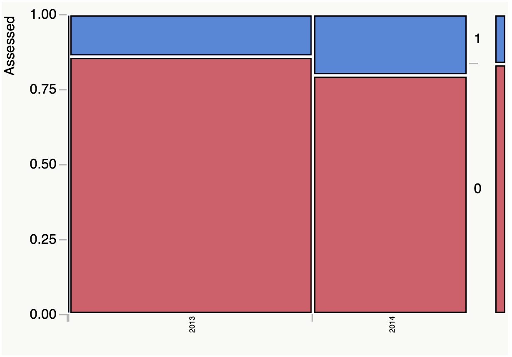
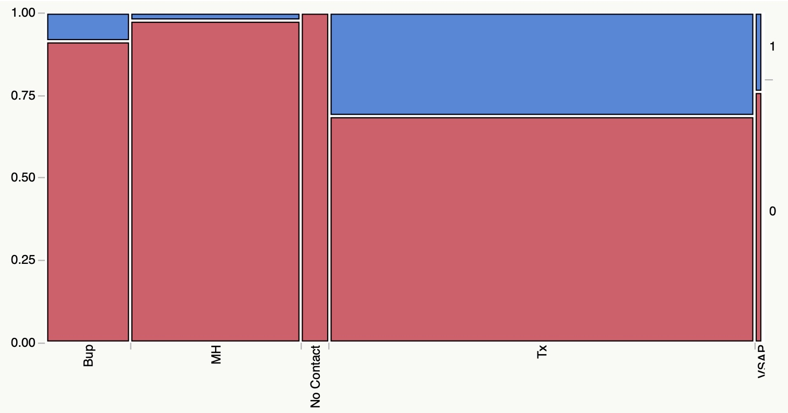

<h2>Outcomes Using ADAM</h2>

### Background

The only treatment center that used ADAM to my knowledge is my old treatment
company, Townsend. The philosophy of Townsend was to do everything necessary to
create more recovering people now and in the future. Rather than wait until
people showed up for treatment, we actually used the principles of ADAM from
out marketing onwards. Every employee leaned the ADAM way, and even the janitor
knew he was saving lives by doing his job well.

### Inquiries

Inquiries come from several sources. Some heard Townsend’s message on radio or
saw it on the internet. Some were referred by healthcare providers or family
members. The best source of inquires at Townsend was alumni.

### Inquiry Conversion
When someone called Townsend, a large part of what decided their action at that
point was how staff respond to them. The truth is that most people who make a
call for treatment for themselves or others don’t follow through. This has been
the norm in our field. Townsend embarked are a plan of continual improvement
with the knowledge that only half the people who call will ever get another
chance at treatment. Our goal was to get everyone who calls to treatment of some
kind after assessing them. The first measure of success was to get the patient
to an assessment.

Here is a comparison of 2013 and 2014 showing that Townsend improved the
percentage of calls who’s inquiry became an assessment:

Figure 22 - INQUIRY CONVERSION TO ASSESSMENT BY YEAR

Still, a 20% assessment rate, even though a great increase from 14%, is not good
enough. Let’s take a deeper look at 2014’s inquiries to see some of the reasons
the rate is still so low. 12% of people who called, called only looking for
Buprenorphine treatment without other treatment interventions. We were able to
get 8.66% of them to come get assessed for IOP even though they had no intention
for that when they called. We could do better, or perhaps we could develop
another level of care for them so that we could get them what they want while
trying to move them to more definitive care. 24% of the calls were for mental
health care, probably prompted by our doctors’ inclusion in insurance panels.
Rather than just say we do not do primary mental health care at Townsend, our
phone center spoke to each of these people about the nature of their complaints
and referred them to appropriate mental health providers. In 2.28% of the cases
the callers chose to come in for an assessment. 1% of the patients called
seeking services at a forensic program that Townsend used to maintain. 24% of t
hem came in for assessment. 59% of callers were seeking intensive outpatient or
inpatient treatment for addiction, and 31% of them came in for an assessment.
The remaining few percentage of patients were inquiries made over the internet
by people we were not able to contact. Here’s the picture:

Figure 23 - INQUIRY TO ASSESSMENT CONVERSION BY INQUIRY TYPE

Assessment Conversion – But what happens once someone comes in to assess? They may be greeted by people who don’t seem to care or they may see something they don’t like. It isn’t just the person doing the assessment that impacts the assessment to admission conversion ratio; it’s the physical plant and all the people in the clinic. In 2013 Townsend admitted 81% of the people who came in for an assessment. That was a record for us. In 2014 that was down to 70%. The first few months of 2014 showed the initial impacts of the passage of the ACA and rapid and sudden alterations of Townsend’s provider contract with one of the primary insurers in Louisiana. As you can see below, the first three months of 2014 had the lowest conversions of the year. These have steadily improved but the alteration of patient compensation has kept us from getting back to last year’s levels. We are engaging on multiple fronts to bring our conversion rates back above 80%.

Figure 24 - ASSESSMENT TO ADMISSION CONVERSION IN 2014

Engagement – Others may have other definitions but Townsend defines engagement as the percentage of scheduled groups that the patient attends. It is a basic principle that if the patient is not in the group they will not benefit from the group. Townsend holds group five days a week as opposed to the normal three for IOPs. It will become clear why in a bit.
Here’s the picture of engagement for Townsend’s patients in the first half of 2014:

Figure 25 - AVERAGE SESSIONS PER WEEK ATTENDED (ENGAGEMENT)

Ten percent of patients came only one day a week on average and 14.7% came only 2 days a week, meaning that over 75% of the patients came at least 3 times a week to IOP. More importantly as you’ll see later, 49% came 4 or more times a week.

Retention – While engagement is a measure of how intensive we’re able to treat the patient, retention is a measure of how long. Essentially retention is their length of stay (LOS) in IOP, but more importantly this can be measured in sessions as well. The average LOS of Townsend’s patients in the first half of 2014 was 45 days and the median was 51. This was a planned decrease from 2013 as we were endeavoring to get patients treated to our end goals faster in order to decrease costs to insurers and consumers. The average number of sessions attended by Townsend’s patients in that same time period was 19.5 and the median was 19. This is also a decrease from 2013. Such a decrease can be due to more patient abandonment early in treatment or faster treating to our endpoint of a DAS of 17 as is discussed below.

Completion – Several factors affect completion at Townsend. The overall completion rate, where completion is defined by successfully getting to a DAS of 17 or completing 35 sessions of IOP, is about 50%. Let’s look at some of the factors that affect completion.

	Session Density- Session density is the number of sessions the patient attended divided by the length of stay (LOS). When multiplied by 7, this gives an average number of sessions the patient attends per week. The Townsend IOP program is five nights a week. In a recent study of 226 sequential admissions, 14% attended less than once a week before discharge, 7% about 1 per week, 15% twice a week, 15% three times a week, 33% four times a week, and 16% five times a week. As you can see below, those who came at least 4 times a week had significantly more chance of completion than those who came less than 4 times a week. The people who came less than one time a week were mostly admission reversals, people who admitted but decided not to come after they admitted. These usually happen because the person paying or the legal enforcer of the decision to come to treatment decided inpatient was the only way they’d accept. Many people have heard that IOP is three times a week, and that is all they will attend. One can see that this is not the most effective session density. Those attending 1 to 2 times a week often present life circumstances that prevent their attending more frequently. This also has proven not to be as effective.

Figure 26 - TREATMENT COMPLETION RATE BY SESSIONS PER WEEK ATTENDED

	Insurance Carrier- Many insurance carriers have arbitrary limits on the number of sessions they’ll allow or feel if a patient isn’t using for two weeks then they no longer need care. The majority of non-completers at Townsend are due to this sort of limitation. Here’s a look at some of the variability by insurer for the major payers for our patients.

Figure 27 - SESSIONS APPROVED BY INSURANCE CO

You can see that there is some significant difference between the highest and lowest. This difference is mirrored in the patients’ success:

Figure 28 - TREATMENT COMPLETION RATES BY INSURANCE CO

In fact, the correlation between the average number of sessions allows for its patients by insurance payer and the completion rate explains 50% of the variance of completion and the p value is .048.

	Doctor Density- Townsend is a medically intensive program and each patient is scheduled and encouraged to see their addiction medicine physician at least once a week while in the IOP. Most patients have a problem doing this, their insurance won’t pay for such intensity or they have been told they shouldn’t take medicines so they don’t want to see a doctor, or some other factor. For those patients willing to get this intensive medical care, you can see below that the completion rates are much higher than for lower levels of medical intensity.

Figure 29 - TREATMENT COMPLETION RATES BY DR VISIT FREQUENCY

Adherence to abstinence – Finally we get to what most of our field thinks is the only outcome that matters. In fact, when viewed as a chronic illness, successful treatment of addiction isn’t negated by slips into using, but rather by the patient’s continuous attempts at recovery. So a positive drug test is seen as lack of adherence to the agreed upon care plan, not a failure of treatment. Rather than remove such a patient from the clinic, we endeavor to find what issues brought about such non-adherence and correct them. Until they have disengaged from care, they can be seen as a success. However, in light of much controversy in the field, especially around the use of buprenorphine, Townsend has kept track, using urine testing, of the abstinence of our continuing care patients.

First, let’s discuss the controversy. There are numerous studies in the literature describing the outcomes of buprenorphine maintenance. One  described better abstinence on methadone than buprenorphine at three weeks and better retention out to 20 weeks. Retention was still lower in that study than at Townsend and the best abstinence rate was 65%. Another  showed better abstinence on buprenorphine (53%) than methadone (29%) and better retention for buprenorphine (30%) than methadone (20%) at 25 weeks. Again, maximum retention isn’t close to Townsend’s. Many have said that with these low levels of abstinence from other drugs, buprenorphine is not a good treatment.

Townsend’s medical model is not focused on buprenorphine. It is focused on finding the right medication to aid the patient in getting into and stay in recovery from addiction. Here’s the picture for a cohort of 204 former Townsend IOP patients maintained on buprenorphine:

Figure 30 - ADHERENCE TO ABSTINENCE BY MONTH SINCE DC
Even out to 11 months after DC abstinence rates exceed these two studies. The primary drugs used in non-adherence to the care plan in this group are benzodiazepines, alcohol and cannabis. Townsend monitors our continuing care patients regularly and intervenes quickly to reestablish the care plan when non-adherence is detected.

DAS Improvement – The DAS is unique to Townsend, and it is most important. It is both the means for personalizing care and for measuring the patient’s progress. It is the first quantitative measure available to gauge treatment progress. Townsend has tried to improve it’s interventions as directed by repeated DAS measurements so that patient progress can be faster. As we note the DAS every week of treatment we can follow the progression of each patient or of our population as a whole. Here’s a picture of our first half 2014 DAS progress by session to our 2013 data:

Figure 31 - DAS BY SESSION 2013 VS 2014

What you see here is that for any given session, the DAS score for 2014 is one DAS point higher than for 2013. We’ll see how important that is in a bit.

Cost Savings – The DAS is important because it correlates inversely with two important and costly proxies for continued using: the number of emergency department visits and the number of hospital days. Here’s the picture for ED visits: p=.01

Figure 32 - ED VISITS PER 100 DAYS BY DCDAS

You can see that the greater the DAS score at discharge, the lower the average number of ED visits are per 100 days after DC. This data went out to two years after DC. We see the same sort of relationship with hospital days per day since DC:

Figure 33 - HOSPITAL DAYS PER 100 DAYS SINCE DC BY DCDAS

It should be noted that this population wasn’t Townsend’s successful completions, or even Townsend’s completions, but rather admissions. We compared this to people who didn’t come to Townsend at all but had called and found that we had a remarkably lower rate of both measures than people who sought treatment elsewhere. We presented this data and other data as cost savings to insurance companies. In short people who came to Townsend cost insurance companies $50 less a day, every day after treatment, even if they don’t finish at Townsend.

What is remarkable is that these measures vary with the discharge DAS score meaning that our treatment goals directly impact a proxy for abstinence and sobriety. That one point of improvement between 2013 and 2014 means half an ED visit a year and one hospital day a year less that each Townsend patient will cost some insurance company. That’s a $2100 a year savings that we produced with our quality improvement efforts.

 
