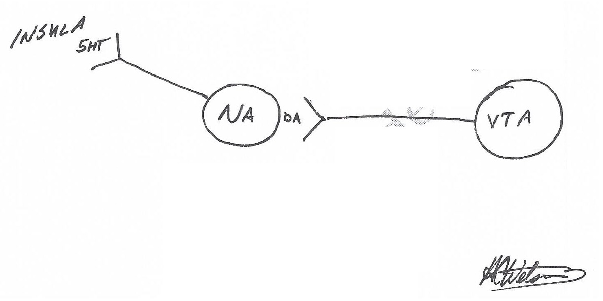
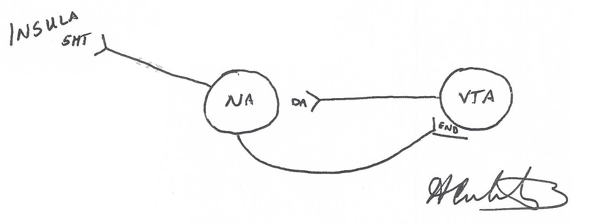
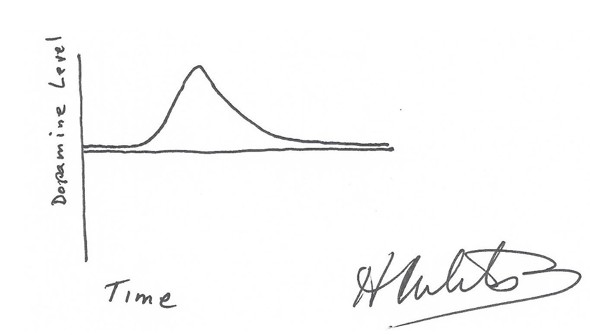
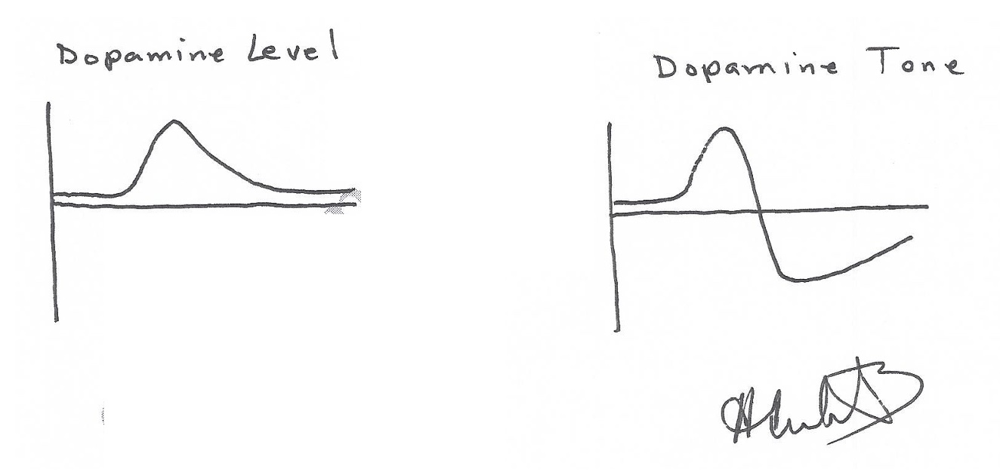
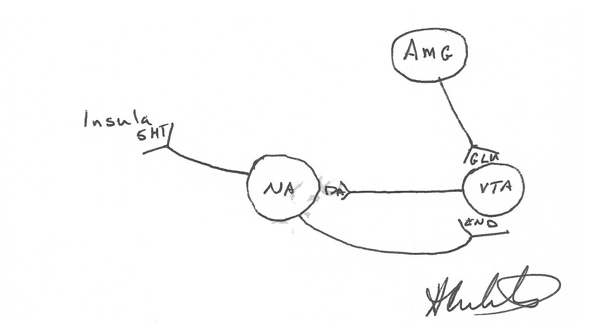
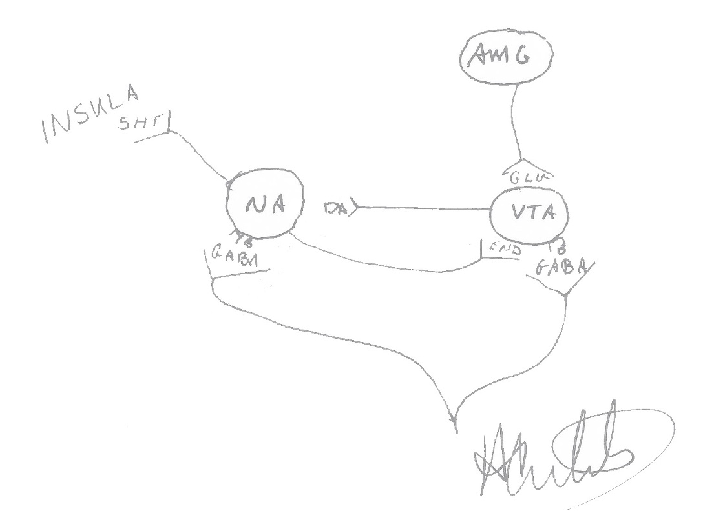
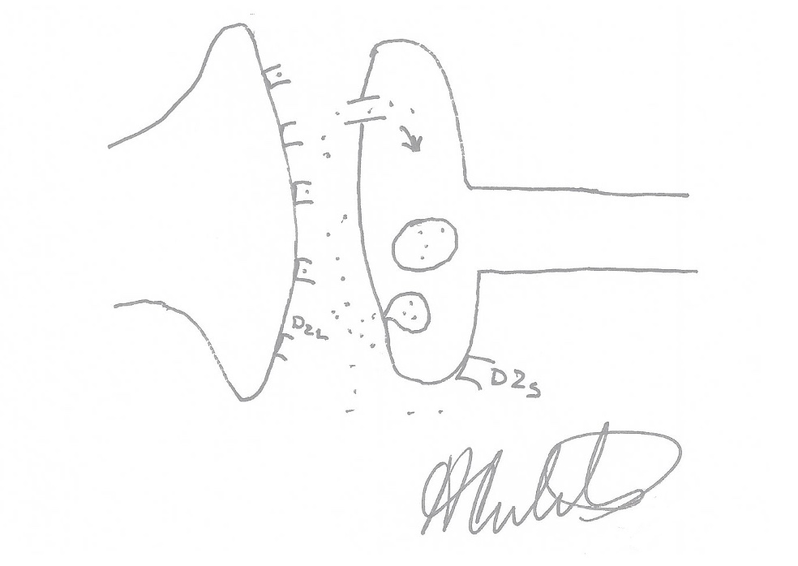

<h1>Biology Basics</h1>

 
Self Pre-test
Test your knowledge and your pre-existing ideas before reading Biological
Basics. You’ll have an opportunity to review your answers and more later.

	How many addictions are there?

	Why does someone with addiction use the drug they do?

	If a person with addiction stops using drugs, do they feel better?

	What percentage of people with the chronic biological brain illness of
    addiction experience spontaneous cure?
 

<h2>What Addiction Is</h2>

I think the physicians of long ago were better observers than we are today.
Perhaps it’s because they had those long dark nights with nothing to do but
review their notes of the day’s patients. Maybe it’s because they didn’t have
much in the way of lab tests to back up their diagnoses. In any case, I think,
even when they didn’t get the biology right, they were great observers.

Our society’s current definition of addiction comes from the DSM[^12] which was
supposed to be atheoretical, but which, by definition, is born of the theory
that all people with addiction start out normal and just behave differently.
There was no great body of observation of patients behind it, just observation
of behaviors related to drugs. However, there are earlier observations that are
very instructive.

William D Silkworth was a physician specializing in addiction when it was not
popular to treat addiction. During most of his career it was the AMA’s stated
policy that addiction was not an illness and not within the purview of the
physician. Despite that, Silkworth documented a phenomenology of addiction that
remains unparalleled in modern writing. I’m sure there were many others, who
like Silkworth, couldn’t be published in peer reviewed literature as their ideas
and observations were not acceptable at the time, but Silkworth is unique
because his views are documented by the laymen who wrote Alcoholics
Anonymous[^13], the basic text of the society of the same name. Silkworth’s
observations in Alcoholics Anonymous are limited to alcoholism but are
expandable to addiction in general regardless of the drug or behavior used.

He noted two things of great import that tell us what addiction is. First, he
noted that the primary state of the addict is “restless, irritable and
discontented,” and that it is this feeling that prompts them to use the drug
that will give relief. This finding was lost to Addiction Medicine until ASAM
published its new definition of addiction in 2011. Second, he noted what he
referred to as an allergy, that is, an abnormal reaction, to alcohol. He noted
that in alcoholics who drink there is an increase in the desire to drink, a
craving which never happens in the non-addict. So Silkworth is the first to tell
us that in order to have addiction there must be both the continual baseline
symptoms requiring the reward AND the onset of craving once reward use begins.
Let’s give that some more thought.

What would a person be like if they only had the first factor? Such a person
would be unhappy on a chronic basis but would not have an abnormal response to
a drug. Perhaps the drug would work and they would use it for symptom relief,
but they would be able to control their use because there would be no craving.

What would a person be like if they only had the second factor? Such a person
would feel fine on an ongoing basis and have no reason to use a reward, but if
he did, he would have the onset of craving and out of control use. Such a person
would not have any problem abstaining and not need addiction treatment to reach
abstinence.

While Silkworth’s observations are astute, what says they are correct? Silkworth
himself asked the authors of Alcoholics Anonymous to list his views as “The
Doctor’s Opinion” as he had no evidence other than personal observation to bring
to argue his point. However, in the intervening years, much has been learned
about the brain and addiction. We can not only point to biology that explains Dr
Silkworth’s observations, but also show that they are operational regardless of t
he reward used.

## Dopamine Tone

Silkworth’s “restless, irritable, and discontented” maps to the biological
factor dopamine tone, specifically, the dopamine tone at the Nucleus Accumbens
(NA). Dopamine is produced within the cell bodies of the Ventral Tegmental Area
(VTA) and sent down the axon to the synapse with the NA. With enough dopamine
tone at the NA, there is a downstream cascade ending in a serotonin signal
bringing about a calming of the Insula and a feeling of wellbeing. In addition,
with enough dopamine at the NA we can attend, remember, enjoy normally enjoyable
activities and feel normal reward. Because things are rewarding, we will have
motivation. Without enough dopamine tone at the NA there is, as Silkworth said,
restlessness, irritability, and discontentedness.

Because of the chronic and compelling nature of these symptoms, there has arisen
a colloquial expression that has developed among recovering people with
addiction that sums them up. They refer to the “mental obsession” of addiction.
It is the part that they identify as most responsible for the inability to
“stay stopped.”

While we will flesh out this biology in more detail later, it is important to
note now that dopamine tone is not the same as synaptic dopamine level. We must
also consider the receptors that see that dopamine level and NA’s ability to
pass on the signal. We will define dopamine tone as the product of the number
and functional efficiency of the NA dopamine receptors (DR), the amount of
dopamine released into the synapse (DA) and the amount of time that dopamine is
available to the receptors (T). We can create an equation:

<h3>DT = DR X DA X T</h3>

Equation 1 - Dopamine Tone

Each of these factors can be further broken down, but that’s for later. For now,
this equation is sufficient.

At this point, you may feel this is an interesting idea, but that you see no
evidence for it or for it’s primacy. An interesting study may shed some
light[^14]. The authors looked at four groups, recreational cocaine users
without personal or family history of addiction (N=27), healthy volunteers
(N=52), stimulant dependent patients (N=50), and the non-dependent sibs of those
patients (N=50). The increased sensation seeking traits and abnormal cortical
volumes that have been shown in the literature to be associated with cocaine
dependence were seen in both of the cocaine using populations. However,
increased levels of impulsive and compulsive personality traits and striatal
abnormalities on scan were only associated with those patients with addiction
and their non-cocaine using siblings. The primacy of the striatal problem and
its genetic underpinnings are supported by these findings. While cocaine use
certainly has cortical sequelae, there are genetic pre-use factors that are
shared by siblings who go on to use cocaine and those who do not. Unfortunately,
the authors did not understand the disease of addiction and did not ask about
any other compulsive use of rewards. The increased “compulsive traits,” though,
is an interesting hint of such a connection, because such things as gambling and
compulsive overeating are often placed in this context in academic literature.

This kind of pre-drug blunted striatal response was also seen in the children of
alcoholics[^15]. Interestingly, the blunted response from the Nucleus Accumbens
was seen in an anticipation of money reward and was not associated with use of
alcohol. So, it may very well be measuring a common precursor regardless of what
drug or behavior the person can use to reverse the blunting. Again,
unfortunately, the authors only looked at alcohol dependence and did not consider
other rewards.

So the take home message of this section is that the primary symptomatology of
most people with untreated addiction will largely be those symptoms that are
consequent to a low dopamine tone at the NA. Further, we could note that those
symptoms are the very symptoms that would get in the way of the patient’s being
able to profit from standard addiction treatment modalities or 12-step recovery.
You can imagine how much difficulty one would have trying to sit in an AA
meeting filled with strangers while having the symptoms described. That gives
the Addiction Medicine physician an important first target, because the point of
The ADAM Way of Addiction Medicine is to help patients enter and stay in
recovery.

## The Allergy

The other aspect of the core phenomenology of addiction as Silkworth described
it is “the allergy.” To understand this abnormal reaction, we must first see
what the normal reaction is. Most people don’t get a great rise in dopamine from
drugs. For most people, normally rewarding activities are rewarding, and
anything that does cause an increase in dopamine above normal is not perceived
as rewarding. Rather, it is dysphoric. Imagine a drug that caused you to feel
you had obsessive compulsive disorder (OCD), which is what too much dopamine
feels like. Would anyone take it twice?

So specifically with concern to alcohol, as that was Silkworth’s focus, normal
people drink and have not much in the way of reward but rather a slight relaxing
effect. If they drink a little too much, they find they don’t function well and
this is, in general, not rewarding. The idea that there is “enough” is common
among normal people.  They never get craving for the next drink after they’ve
had enough. Silkworth noted that in alcoholics, there was a physical craving for
the next drink that was triggered by the first, something that never happens in
“normal” people. Silkworth did not understand the neurobiology behind this
observation. Luckily, we have enough information today to make sense of it.

When the dopamine spike from a reward reaches the NA, the NA sends an endorphin
signal back to the VTA creating a positive feedback loop. The more dopamine, the
more endorphin; the more endorphin, the more dopamine. This is a very fast
feedback system in which the endorphin signal is happening while the dopamine is
still being released causing more and more dopamine to be released, until all
the dopamine that was lined up at the synapse is depleted. This is followed by a
rapid fall in dopamine level as dopamine is rapidly taken back up out of the
synapse by the dopamine transporter (DT).

Not only does the dopamine level in the synapse fall as a result of this rapid
depletion, but also the dopamine tone falls even further because there is a r
apid response of deactivation of dopamine receptors when a supra-physiologic
rapid rise of dopamine occurs.

So, let’s take this one step at a time. First there is a lowered dopamine tone
and the person picks up a drug to feel better. That drug causes a rapid rise in
dopamine so that briefly tone becomes normal, and there is a reward signal
registering that drug as salient and positive. The dopamine rise was so great
and so rapid that the dopamine receptors at the NA registered that there was too
much signal and rapidly deactivated. The VTA is now temporarily depleted of
dopamine and the normal reuptake process that was overwhelmed by the rapid
release is now clearing the synapse. As dopamine level falls, dopamine tone is
falling even more rapidly because there are not as many functional dopamine
receptors as before the first hit of drug. Now, quite rapidly, the person with
low dopamine tone that needed a drug has a lower dopamine tone than he had in
the first place and an even greater need for drug. This is the biology of the
compulsive use that Silkworth called “the allergy.” It is the origin of the
phenomenon of craving in addiction.

## The Point of Addiction Medicine in a treatment program

*This is a good point to bring up what the point of addiction medicine is in a
treatment program. If we understand that the primary symptomatology of addiction
is that stemming from low dopamine tone in the midbrain, and we understand that
those symptoms are exactly the symptoms that will interfere with the treatment,
then it makes sense that the first goal of an Addiction Medicine specialist
working in a treatment center will be to stabilize midbrain dopamine tone to
promote rapid response to treatment. Can you imagine having poor memory, poor
attention, poor attachment to others, poor ability to enjoy anything and poor
motivation and be asked to sit in a room for three hours of group? No wonder
most addiction programs have a huge early attrition rate.*

*Not only is attrition a problem that the Addiction Medicine specialist can help
with, but they also the increase effectiveness of treatment. Can you imagine
being a counselor in a group of ten people, all of who have lowered midbrain
dopamine tone? No one is motivated, no one cares, no one wants to come back,
no one listens, and no one can remember what you said. No wonder treatment
centers have, on average, a 17% success rate, and so many counselors burn out.*

## Typology and Life Course

While the core phenomenology of addiction combines both the low dopamine tone
and the high spike/crash of “the allergy,” there exists another typology that
must be explained. Cloninger created what is accepted as the most useful of the
addiction typologies[^16], and, like Silkworth, he did most of his work with
alcoholics. Of note is that Cloninger recruited participants from Alcoholics
Anonymous; the importance of this will become clear in a bit.

Cloninger stated there were two types that he called Type I and Type II. Type
I’s, he said, had late age of onset, few if any legal problems, good education,
didn’t like stimulants, and not much family history of addiction. Type II’s,
however, started their use early, loved stimulants, had a strong family history
of addiction and frequently got in trouble with the law.

<table>
  <tr>
    <th>Factor</th>
    <th>Type I</th>
	<th>Type II</th>
  </tr>
  <tr>
    <td>Age at onset</td>
    <td>Late</td>
	<td>Early</td>
  </tr>
  <tr>
    <td>Personality</td>
    <td>Anxious</td>
	<td>Anti-social</td>
  </tr>
  <tr>
    <td>Legal</td>
    <td>Little involvement</td>
	<td>Much involvement</td>
  </tr>
  <tr>
    <td>Family History</td>
    <td>Little</td>
	<td>Frequent</td>
  </tr>
</table>
Table 1 - Factors in Cloninger's Typology

Of note is that he stated that Type I was the main type of alcoholic and
Type II was a less frequent variant. This is where subject selection comes into
play. This typology and prevalence data fit into not only AA’s view of itself,
but also society’s view that alcoholics were nervous types to drank to calm
their nerves and then got hooked because of tolerance leading to alcoholism. At
the time AA didn’t do much to encourage alcoholics of the second type to join.
In fact, alcoholics who used stimulant drugs were often discouraged and told to
go to NA.

In fact, Type II (low dopamine) addiction is much more common, comprising, in
our experience, about 85% of the patients that come to treatment. There are a
few reasons for that. First, we see addiction as a single illness and don’t
specialize by drug, so we aren’t discouraging stimulant dependent people from
coming. Second, Type I’s are much more likely to find their way to AA without
needing treatment and stay there, so we don’t see them as much. But how do we
explain Type I (high dopamine) addiction in the first place?

While it is not the most common way, some people do come to addiction through
abuse of a sedative drug used originally for anxiety or other high dopamine
symptoms. The syndromes that cause such use aren’t characterized by high
dopamine merely in the reward system, but rather high dopamine everywhere. So,
when these drugs, such as alcohol or benzodiazepines, are taken they may cause
a global sedation of the brain via GABAb effect. However, before they do, they
also cause a dopamine reward spike in the midbrain alone via a GABAa effect. So,
they don’t worsen high dopamine symptoms in other parts of the brain but do
create a supra-physiologic reward signal in the midbrain[^17]. One acute
consequence of this, as has been already discussed, is the immediate
inactivation of NA dopamine receptors. Another more chronic adaptation is cell
death of VTA cells.

So, we can imagine a high dopamine person with anxiety and tics that, when a
child, cannot stand any stimulant, even a puff on a cigarette, but that after
decades of drinking how requires stimulant drugs just to feel normal. I have met
many such patients. *What is important to know about them is that their Type I
symptoms must be covered first before we can treat their later emerging Type II
symptoms.*  These patients, while using rewarding chemicals for their sedation
effects, are progressing in the loss of VTA cells faster than one would by age
alone.

That last sentence suggests that there is some loss of VTA cells by age alone
and that is, indeed, the case. We are all losing dopamine receptor at about 7% a
decade and we are losing VTA cells at about 7% a decade so we are losing
dopamine tone at somewhere between 7% and 14% a decade or about 1% a year, if we
aren’t using[^18]. If we are using drugs that cause supra-physiologic spikes at
the NA, we will be progressing even faster.

*This brings about another major goal for Addiction Medicine. The Addiction
Medicine physician must remember that he or she is treating a chronic
progressive illness, and that the point of treatment is to keep the patient
alive long enough to die of something else. No one lives forever, but our goal
is that no one need die of addiction.*

## Cue Induced Craving and Glutamate

Most people with addiction will tell you that stopping isn’t hard; it’s staying
stopped that is hard. So some information on the biology of restarting is
apropos. Numerous studies have been done regarding a particular paradigm called
reinstatement. In the reinstatement paradigm, the experimental animals are
fitted with catheters directly in their vena cava, the main vein from the body
to the heart. They are then allowed to administer drug through the catheter by
the press of a lever. The animals are placed in a cage with drug available for
self-administration about two hours a day. They cannot be left in that cage for
longer, as they would die of dehydration because of continuous drug use. Every
day that they go into the cage there is a cue, for instance a red light or a
tone playing, that signals the availability of drug.

At some point after the animal has been going into the cage for an extended
period, the experimenters stop the drug and allow the animal to only administer
saline. At the same time, the cue associated with the drug is also stopped. Of
course, if the drug was something that causes physical dependence, like heroin,
the animal will go into withdrawal and increase drug seeking to avoid
withdrawal. However once physical withdrawal is past the animal stops pressing
the same lever that used to get drug; in essence he stops seeking drug. Every
day the animal is placed in the same cage and allowed to press the lever but
doesn’t. After all, there’s more dopamine release from eating rat chow than
pressing a useless lever. You can put the animal in the cage every day without
drug for half its life span, 40 of our years, and it won’t go back to the lever
unless you do one of three things. These three things teach us a lot about
reinstatement of drug use.

The first thing is a free hit of drug, any drug[^19]. When this experiment was
done with heroin, drug seeking was reinstated with a hit of nicotine. Anything
that causes a spike and crash of dopamine will reinstate drug seeking. That’s
what you would guess from your knowledge of the positive feedback loop between
the VTA and the NA. *To avoid reinstatement from this cause, you must avoid the
crash. To avoid the crash, you must avoid or mute the high.*

The second thing is stress, but not big painful stress like a painful shock.
If something like a painful shock happens the animal just jumps and goes back
to eating rat chow. However, if the shocks are just annoying and random, they
cause the animal stress. Under such stress the animal runs back to the lever.
Further studies have shown that chronic stress flips the switch that causes
Corticotropin-releasing Factor (CRF) to go from causing an increase in dopamine
release to a decrease in dopamine release[^20][^21]. So, this “relapse” is
because of a decrease in dopamine tone secondary to a lowering of dopamine
release. *To avoid reinstatement from this cause, you must avoid a decrease in
dopamine release or other cause of lowered dopamine tone caused by chronic
stress.*

Finally, the third thing is the resumption of the cue[^22]. Play the tone or
turn on the light and the animal runs back to the lever. This cannot be
explained by the two factors we’ve already discussed, at least not directly. It
turns out that cue induced craving is caused by a glutamate[^23] signal from the
Amygdala to the VTA that causes the release of dopamine. Commonly patients refer
to this a euphoric recall, but that doesn’t tell the whole story. We aren’t just
recalling the euphoria of the dopamine spike; we actually feel it because of
this glutamate signal.

There is a dopamine spike and crash, and the crash causes the craving. So, the
biology of the cue induced reinstatement of drug seeking is indirectly the same
as that of a free hit of drug. It’s just that the “drug” in this case is seeing
a cue that reminds us of a previous using event. *To avoid this kind of
reinstatement you must avoid or modulate down the glutamate signal from the
emotional memory centers.*

## GABAb and High Spike

To fully understand the spike and crash we must add two more modulating factors
to our model. The first is the GABAb receptor found on both the cell bodies in
the VTA and the NA. The action of GABA at the GABAb receptor is to decrease the
release of endorphin and dopamine[^24] so that the spike is muted and there is
not a crash resulting from exhaustion of the system. Someone with insufficient
GABAb function would have a higher-than-normal spike even if they have normal
dopamine tone. Imagine someone with “the allergy” but not with the restless,
irritable and discontented background that leads to the first use.

The other factor is a complication in our understanding of the dopamine
receptor. In most cases when we talk about dopamine receptors, we are referring
specifically to the D2 receptor at the synapse between the axon of the VTA and
the cell body or dendrite of the NA. There has been quite a controversy in the
literature about the D2 receptor. Some said it was a stimulatory receptor at the
NA and some said it was an auto receptor that shut down dopamine release. It
turns out both are correct.

The D2 receptor exists as a splice variant. That is there is a place in the gene
that causes a splicing of the exonal fragments differently so that two forms of
the protein are made. There is the D2L, which is the excitatory receptor on the
NA and D2S, which is the auto receptor on the VTA axon[^25].

So, in the normal person, as dopamine is released there is enough to trigger the excitatory response from the NA and enough to provide negative feedback to the D2S auto receptor to shut off dopamine release when appropriate. In the person who doesn’t have enough dopamine there is not enough to get an excitatory response or to shut the signal off. If drug is taken, there is an acute rise to excite a rewarding signal, but only a slow response to shut off release. This causes the low dopamine person to have a higher-than-normal spike. That’s a perfect set up for attachment to external rewards: low tone and unrewarding normal activities and a sufficient spike to cause reward and attachment only when an external event causes it.

For the person in addiction treatment, as you raise his dopamine tone with whatever medication is appropriate, his dopamine spike will fall to accommodate his need. As he needs a lower spike, he will get a lower spike, in most cases. However, in some cases, because of a genetic polymorphism of the gene for the D2 receptor, DRD2, there is insufficient D2S produced. Such a person will not have a compensatory lowering of his dopamine spike as we raise his dopamine tone. His dopamine spike will stay high regardless of the change in his dopamine tone. Such a person may complain of high dopamine symptoms or continue to use because of “the allergy” in spite of normal dopamine tone.

Such people can be treated to mute the spike by using any agent that is more GABAb than GABAa. Generally, the Anti-epileptic drugs (AEDs) are useful as well as baclofen, the only pure GABAb agent approved for human use.

Of note here is that benzodiazepines generally affect GABAa more than GABAb. GABAa causes the release of dopamine rather than a slowing of its release. This makes the benzodiazepines rewarding and unsafe to use in people with addiction. This has recently been reinforced clinically by work showing that regardless of whether addiction was present or not, all cause rates of death are increased in patients taking anxiolytic or hypnotic agents . So, it is a basic principal of the Townsend Way never to use benzodiazepines to affect GABAb.

Where the drugs work

In order to understand what to do for a patient who has the primary illness of addiction you must know what’s wrong. It would be nice to have a test for that, but we’re not there just yet. Instead, we rely on the age-old art of taking a history. In this case it’s not the history of drug use that most people are taught that focuses on the behavior and amount and timing. In our history taking what’s important are the biological cues that tell us what the patient needs in the way of medication. For us to knowledgably take this history, we need to know where all the drugs work in our model.

Figure 8 - WHERE THE DRUGS WORK

As you can see, certain drugs work in very specific places while others, such as alcohol, work just about everywhere. To use the model, what you want to find out is which drugs alleviated what symptoms. For instance, if alcohol alleviated high dopamine Type I symptoms, it’s probably acting via the GABA system outside the reward system. If alcohol alleviated low dopamine Type II symptoms it could be acting anywhere inside the reward system.

Additionally, even a drug like cannabis, which only acts at the one place, can tell you little because of where that place is. The CB1 receptor is on the cell body of the NA, and therefore stimulation of that receptor can mimic dopamine tone without actually raising it. So, what is necessary is in depth knowledge of this system, not just a cursory view of a table of effects. However, everyone wants tables so here they are:

Table 2 - Type II Effects of Specific Drugs
Drug	Action	What It Tells You About the Patient
Opioids	Mu opioid receptor Agonist	Benefits from dopamine release
Amphetamine	Reverses dopamine reuptake pump	Benefits from dopamine release
Cocaine	Blocks dopamine reuptake pump	Has enough release to benefit from reuptake blockade
Nicotine	Nicotine Receptor Agonist	Benefits from dopamine release
Alcohol	Multiple	Not much
Cannabis	CB1 receptor agonist	Not much
Benzodiazepines or Barbiturates	GABAa	Benefitting from dopamine release

Now this list is for Type IIs. It essentially is saying what the drugs are doing to increase dopamine tone. There are people who are using drugs to decrease dopamine release or for other reasons entirely. In addition, there are patients who were originally Type I and now have Type II symptoms as well that may be using a cocktail of drugs in order to attempt to manage mixed symptoms. The table for Type I effects is below:

Table 3 - Type I Effects of Specific Drugs
Drug	Action	What it Tells You About the Patient
Opioids	Mu Opioid Receptor Agonist	Don’t get dopamine release from opioids
Cannabis	CB1 Receptor Agonist	Benefitting from sedating properties
Sedatives	GABAa and GABAb	Benefitting from sedating properties or from GABAb decrease of dopamine release
Alcohol	Multiple	Not much

There are a few different lines of thought that must be kept in mind simultaneously: Type I symptoms, Type II symptoms, specific actions and time course of drugs at reward center, changes in reward center stemming from past drug use, and other factors. It takes experience to keep all those in mind at the same time. But they all come down to the same thing, finding out why the patient is using what they are using. Only with that knowledge can we devise a specific medical regimen to relieve the symptoms that get in the way of recovery. So it is a basic principal of the Townsend way to understand why the patient uses what he uses, not just what he uses.

The Difference Between a Drug and a Medicine

Seeing that we focus our medical interventions on the same mechanisms affected by drugs, some people ask, “So why would I want to substitute one drug for another.” This brings up the difference between a drug and a medicine. Here’s my answer.

“A drug is something I use, when I want to, to change how I feel right now; a medication is something I take, as prescribed by someone else, to effect a chronic problem without changing how I feel right now.” Some may find fault with that, so I’d like to explore some of the implications with you.

Imagine this scenario. One patient is free from using what brought him to treatment and taking buprenorphine daily as directed from which he feels no lift or other acute mind-altering effect. The other patient is also free from taking what brought him to treatment and smoking cigarettes whenever he wants to or feels the need.  He is smoking more now that he did when he was “using.” Now, ask yourself: “Which patient is more sober?”

Often, I’ll hear from family of a patient on a medication that they are uncomfortable with the patient taking a chemical to free him from the use of another chemical. I have developed a three-point test to show families and patients the difference between a drug and a medicine. Again, I’ll pick on buprenorphine. I ask the patient, “When you were taking the opiates did taking them make you want to take more?” If they answer yes, I’ll raise one finger. “Did taking them make you high?” If they say yes, I’ll raise a second finger. “Did taking them make you do stupid things you regretted later?” If they say yes, I’ll raise a third finger. “Now, when you take Suboxone does it make you want to take extra Suboxone?” When they say no, I drop a finger. “When you take Suboxone does it make you high?” When they say no, I drop a finger. “When you take Suboxone does it make you do stupid things you later wish you hadn’t done?” When they say no, I drop a finger. I then say, “So Suboxone may be an opiate in the test tube, but it doesn’t seem to be working like an opiate in your brain.” That usually helps people settle down.

The Townsend Way uses medication but does not use drugs. Chemicals used to increase dopamine tone are used to increase the tone but not the reward pulse itself. To illustrate the difference, imagine that you are on a dock and the boat is on the water 6 feet below you. You could wait for the tide to come in and raise the boat to your level, or you could hope for a six-foot wave that would bring the boat to your level for just a couple of seconds. Which do you think is safer? In this example drugs would provide the wave and medications would raise the tide. We will need to wait longer for the effects of the tide, but it is safer in the long run. It is a basic principle of the Townsend Way to use the longest acting, most tonic medication when raising dopamine tone and not substances that work fast but only for a short period of time.

Biology of Recovery

So far, we’ve focused on the dopamine side of the dopamine tone equation and haven’t mentioned dopamine receptors. Any model of the biology of addiction must explain why some people get better without any medical intervention. I believe we can put these two together and create an answer. First, we’ll have to review one of my favorite studies .

The researchers used 4 normal infant male monkeys. They knew the monkeys were normal for two reasons: they had normal density of D2 receptors on PET scan and, when offered cocaine, they didn’t like it. Remember, if you have enough dopamine tone, something that raises it is not actually pleasurable.  Then they took the monkeys away from their mothers and housed them individually where they couldn’t even see each other. So, in essence, each monkey was in solitary confinement. Rapidly the D2 receptor density was lower on PET scan and now, when offered cocaine, the monkeys avidly used it. When dopamine receptor density fell so did dopamine tone. The cocaine returned dopamine tone to normal by raising dopamine level now that the monkeys were isolated.

They then raised these monkeys with continued isolation and cocaine use to the age of adolescence and put them together in a troop-sized cage. The first thing the monkeys did was to fight to find out which one was the alpha male. After that was decided, the researchers rescanned the monkeys. The alpha male’s D2 receptor density returned to normal, and he used much less cocaine than before. The other three subservient yet socially housed monkeys still had lower D2 density and continued to use cocaine the same as they did when alone.

This study shows me that the stress of being isolated and the stress of feeling less than are the same stress, that the stress decreases D2 receptor density and, therefore, dopamine tone.

Think for a minute what someone gets from an AA meeting: you are never alone again, and you aren’t less than anyone. Think what happens when someone is living a 12-step life: I am here to help and therefore have enough to help with; I’m not alone because I have a higher power; so I’m not alone or less than.

Now let’s look at our equation again:

Equation 2 - Dopamine Tone
DT=DA × DR × T

and put the factors into a table.

Table 4 - Effect of Various Interventions on the Factors of Dopamine Tone
Factor	DR Density	DA availability	Time
Intervention	Recovery	Increase DA production or release	Block DA reuptake pump or block DA catabolism

Because it is the goal of the Addiction Medicine physician to increase the dopamine tone of the patient on a long-term basis, each of these factors is critical to us. We cannot focus on increasing dopamine and ignore the receptors. We cannot handle the medications and ignore the recovery aspects.  It is as important for the Addiction Medicine physician to understand the mechanisms of recovery, whether he’s in recovery himself or not, as it is for any other physician treating a chronic illness to know the mechanisms of lifestyle change on that illness. We cannot abdicate this responsibility to the counselors; we are the only ones who can credibly explain the biological reality to the patient. In essence, the equation tells us that without recovery, the patient will always need medication. That is, their only way off medication, or to a lower dose and a more sustainable future course, is recovery. So it is a basic principal of the Townsend Way that the physician be a primary advocate for the patient’s entering a recovery lifestyle.

I am not advocating only for the 12-step recovery culture. Any recovery will do but let’s look at what is necessary in a recovery culture for it to effect D2 density. I learned from reading William White’s monograph  that there are five attributes that any successful recovery culture has to have:

	A community – no one recovers alone
	Horizontal interactions – no hierarchy, everyone is equal regardless of recovery time
	A mentor – a loving teacher who is not a boss but who shares what worked for him
	Confession/Amendment – while it need not be public, it is important for at least one other human being to have heard what shames us and still find us acceptable
	Serving others – this is a technique that many recovery cultures have found to be a sustainable source of dopamine receptor density, though they don’t put it that way

If your patient has such a program, that’s fine. If they have found a non-12-step program that doesn’t meet these five criteria or they have fallen into a version of 12-step recovery in which one or more of these are lost, it is the physician’s responsibility to advise them on the biology so they can decide if they want to change.

This information also leads me to the advice I give to people wanting to get off medications or set some time limit to their medications. I usually say instead, “Stay on the medication until you’re finished your ninth step. After that, let’s try to taper.” The information does two things: focuses the person on the biology rather than on an artificial deadline, and puts the patient in charge. They can’t come back later and say, “I don’t want to work the steps so I’d like you to raise your magic wand and give me more dopamine receptors so I can stop the meds.” It is a basic principal of the Townsend Way to advocate for patients to stay on their medication until they have the maximum opportunity for success off of the medication.

The Point of Addiction Medicine

This brings us to the discussion of another goal of Addiction Medicine. In my mind, it’s not just the goal, but rather the whole point. It is the reason a medical model should be used.

I believe that the point of Addiction Medicine is to use biological interventions to raise dopamine tone so that the patient can get into and sustain recovery. Once there, if there is no need for medications to enhance dopamine tone, then they can be tapered off. If, through aging, dopamine tone falls during recovery and increased dopamine tone is necessary to sustain recovery, medication can be added back.

Some people who have long held a position that there is no role for medication in recovery have now come to believe that medications can be useful in getting people into recovery. But the idea of using medications to affect addiction after years of recovery is still alien to them. To these people, recovery should give all the answers, and there should be no need for addiction medication later in life. I think this position ignores a basic fact of aging, that nothing physical is exempt from the process. We don’t think our pancreas is exempt; why should we think our mid-brain is?
It is a basic principle of the Townsend Way to intervene medically, psychologically, or educationally at any point in the addicted patient’s lifecycle when interventions are necessary regardless of how many years the patient has in recovery.

Other DA Releasers and What is a “Drug?”

This brings us to another way of looking at what is a “drug.” The word drug is in quotations because what we should really call them are rewards; they don’t have to be external chemicals. Once you understand the neurochemistry and understand the final common pathway of dopamine tone and dopamine spike, it becomes clear that whatever the cause, the effect is the same. Our midbrains have no way to tell the difference between a spike of dopamine caused by heroin or by eating a piece of cake. Dopamine is dopamine.

So whatever causes a spike of dopamine at the reward center can be rewarding. Whatever causes an increase in dopamine tone will be sought. Here is an incomplete list of things found in the literature that increase dopamine tone temporarily:

	Dangerous or risky behavior
	Staying up late
	Sleeping late
	Being the center of attention
	Being liked
	Making someone smile
	Completion of a hard task
	Sexual climax
	Taking in food
	Drugs

Here are some things that are known to decrease dopamine tone:

	Isolation
	Being in a subservient social position
	Shame
	Chronic Stress

Now, there may be a spectrum such that some of these things create higher supra-physiologic spikes than others. Given that the loss of VTA cells is going to be greater given a higher spike, one might say that, in general, cocaine is going to be more damaging than, say, overeating. However, it may not be as simple as that. There is probably a good deal of undiscovered genetics surrounding what determines the height of a spike from a given reward. There are people who have a higher spike from a sugar binge than they do from cocaine. So rather than focus on the drug, it is more important for the medical treatment of addiction to focus on the specific patient’s spike.

There is good evidence that shows that patients who abstain from the reward or chemical that brings them into treatment but continue to use other spike causing rewards have faster progression and greater chance of restarting the reward they originally tried to stop . There is no reason to believe this is not true of all spike-causing rewards. Imagine a highway where heroin and cocaine are the left lane, alcohol is the middle lane and compulsive overeating is the right lane. Regardless of what lane you’re in, the road is still going to the same place; it’s just a decision about how fast you want to get there. If the goal is to avoid the death from addiction, it’s best to get off the road entirely.

This means that the old “one drug at a time” method of addiction treatment is not good long-term care. It means that smoking cessation is not different from addiction treatment in addiction patients. It means that it is not okay for someone to stop drinking and start overeating. It is a basic principle of the Townsend Way to advocate for abstinence from all rewards that cause supra-physiologic spikes for the patient and to help the patient gain the dopamine tone they need to not crave or seek any such reward.

Where the Medications Work

When thinking about the medications used to treat addiction, we must divide them into the appropriate categories. They are:

	Medications used to ease withdrawal
	Medications used to raise dopamine tone
	Medications used to decrease cue induced craving
	Medications used to modulate dopamine spike

There is another category that is often included in addiction medication lists, but it is a better treatment for substance abuse than addiction as the point of the treatment is to stop the behavior of drug taking rather than to treat the underlying condition. That category is:

	Medications that completely block dopamine spike

Medications to ease withdrawal: These medications work outside the reward system and aren’t directly addiction treatment. Medical withdrawal, also erroneously called “detox,” is not a form of treatment for addiction, but rather a specific easing of the symptoms of substance withdrawal. The biology of withdrawal has more to do with a part of the brain called the Periaqueductal Gray and structures that direct autonomic tone, and only has an indirect effect on lowing dopamine release. As such, medications aimed at easing withdrawal act for this purpose outside of the reward system. In the case of withdrawal from opioids, the medications used work at the opioid receptors in various parts of the brain as well as the periphery, especially the intestinal tract, to ease withdrawal. In the case of sedative hypnotics, the medications for withdrawal act primarily at GABA receptors in the brain. There are general medications that don’t specifically counter primary withdrawal but only decrease symptoms, such as clonidine, and are inappropriate as stand-alone medication in sedative hypnotic withdrawal because they do not decrease kindling or the risk of seizure.

The idea of stopping kindling is a paramount principle in treating withdrawal from sedative hypnotics. Some other principles are to not taper the exact chemical that caused the tolerance in the first place, use instead a cross tolerant agent. Another principle is to use the longest half-life medication possible to provide for the slowest smoothest taper. Details about choice of medications in various environments is beyond the scope of this book and well detailed elsewhere.

Medications used to raise dopamine tone: This group is quite a heterogeneous group as there are several ways to raise dopamine tone depending on the specific pathology of the patient. These medications should be considered in the “upstream to downstream” order in which dopamine tone is produced. The order is important because if the system has a “dam” upstream, trying something to increase flow downstream is not likely to be that effective. That order is

	Dopamine Production
	Dopamine Release
	Dopamine at the Receptor

Dopamine Production: Currently the only medication we have identified that effects dopamine production is L-methylfolate. For those with a specific genetic defect of the MTHFR gene, the production of L-methylfolate from folate is diminished, and, as L-methylfolate is necessary for dopamine production, the production of dopamine is reduced. Taking L-methylfolate will restore dopamine production to normal in those patients. Also anyone taking medication that decreases the effectiveness of MTHFR could benefit from L-methylfolate as well.

An example of the importance of this is seen in this comparison of patients at Townsend who had genetic testing and were offered treatment. Some of them took L-methylfolate and some chose not to.

Serious polymorphisms of MTHFR are described in the general literature as affecting about 30% of the population. As you can see, there are far fewer people seeking treatment for addiction that have normal MTHFR function than one would expect in the general public, and the effect of treatment on those who are not normal at MTHFR is profound.

The following chart takes some explaining. Across the X-axis, the one that runs horizontally along the bottom, there are three groups of patients listed and the width they take up gives you a visual indicator of how prevalent they are in the Townsend patient population. Along the Y-axis, the vertical one to the left, is a percentage of the patients in each group who completed the Townsend IOP program. The key to the right shows that completers are colored blue and non-completers are colored red.

Of those few percent of patient that had normal MTHFR function from the beginning, all completed IOP treatment for addiction at Townsend. A little less than half the patients had significant MTHFR polymorphism and chose to take L-methylfolate; they had a completion rate above 80%. About half the patients had a significant polymorphism of MTHFR and chose not to take L-methylfolate. Their completion rate was approximately 12%. This finding caused Townsend physicians to begin suggesting L-methylfolate to all admissions even before genetic testing results returned.

Figure 9 - OUTCOME BY MTHFR FUNCTION AND TREATMENT

Dopamine Release: Two known agents cause the tonic release of dopamine from the VTA. They are buprenorphine and varenicline. Buprenorphine works as a long acting partial agonist at the mu opioid receptor. Varenicline works as a somewhat shorter acting partial agonist at the nicotinic acetylcholine receptor. Agonist activity at both receptors causes dopamine release.

Another class of agents that indirectly increases dopamine release is specific monoamine oxidase B inhibitors. Monoamine Oxidase B (MAOb) is the primary breakdown pathway for dopamine after it is taken back up by the VTA via the dopamine transporter (DT). Increased activity by MAOb, for instance because of genetic polymorphism, would result in less dopamine being packaged per vesicle, so that even if vesicular release were normal, there would be less dopamine release. Inhibiting MAOb would return that release to normal.

Finally, a third strategy in increasing dopamine release is not so indirect as negative. It is avoiding the decrease of dopamine release caused by increasing serotonin levels, for instance, from an SSRI medication. When serotonin levels are raised, increased agonist activity at the serotonin 2a receptor (HTR2a) on the VTA decreases dopamine release. Avoiding increasing serotonin will avoid that problem. If, one day, we get specific agents that agonize serotonin receptor 2c, we could use those to increase dopamine release.

It is important to note here one strategy for increasing dopamine release that is useful as a drug, but not as a medication for a chronic condition. That method is amphetamines. Amphetamines cause an increase in dopamine release, though not through the normal channels, but by running the dopamine transporter (DT) in reverse. While this is useful for short periods of time, it leaves the practitioner with one of two untenable choices when treating someone with addiction. Either you treat only part of the day to allow dopamine stores to be rebuilt and have the patient experience a “crash,” or you treat for 24/7 and never allow stores to be rebuilt leading to, at some point years down the road, an untreatable patient who can’t get out of bed and can’t raise the dose of amphetamine anymore because they’re toxic. It is a basic principle of the Townsend way not to use amphetamines to increase dopamine tone.

Dopamine at the Receptor: Once dopamine production is normalized and dopamine release is normalized there still might be people with lower dopamine tone because of problems with dopamine receptors or post receptor signaling problems. Additionally, there may be people who have an overactive dopamine reuptake pump (DAT) or Co-O-methyl transferase enzyme (COMT), though the latter should matter less than the former because DAT is the main terminator of the dopamine signal at the NA.

In those cases, the strategy would be to increase the amount of dopamine at the receptor with a DAT blocking agent such as bupropion.  Do not use amphetamines for this, because, as noted above, they don’t just block the DAT, but run it in reverse causing anomalous release of dopamine rather than a rise in dopamine from the patient’s release during DAT blockade.

There is a caution to be heard about the use of bupropion. If you use bupropion or any other chronic DAT blocking medication in someone with a hyperactive MAOb enzyme, the effect of your treatment will make the MAOb even more efficient, leading to greater DA destruction in the VTA cytoplasm before it can be packaged in the vesicle. While vesicular release would not change, the amount of DA in each vesicle could, so using bupropion in such an individual wouldn’t be the best choice. A MAOb inhibitor would be better.

It is also possible to decrease COMT activity using a herbal supplement called Rhodiola Rosea. This would be best used in people who’s COMT is overactive, however it could boost DA at the synapse by a small amount even in normal activity COMT individuals.

Medications to ease cue induced craving: Cue induced craving is caused by a glutamate signal from the amygdala to the VTA. The VTA then spins up, causing a dopamine release followed by a crash with the fall in dopamine bringing on the craving. Given that stream of action, there are several places one could intervene to decrease cue induced craving. We could block dopamine, we could block the endorphin receptor to make sure that any secondary endorphin release from the NA didn’t stimulate even more DA from the VTA, or we could stop the whole thing from starting by modulating down the glutamate signal. Blocking dopamine makes addicts feel worse and they crave or use even more . Mu blockade often results in the same thing only with the use of substances or behaviors that stimulate the system in a way that bypasses the now useless mu receptor. The best way to ease cue induced craving is to modulate down the glutamate signal that starts the problem in the first place.

There are some principles to be aware of in this treatment. First, cue induced craving is rarely the main reason someone is using when they first come to treatment. That means that if we successfully treat the cue induced craving and don’t handle the other reasons for using, we will not stop the using, and we, and the patient, will interpret that we failed with our medical treatment. Treating cue induced craving is best done after dopamine tone is normalized and use is restricted to that brought on by cue induced craving. At that point, the patient will notice a great change as opposed to little change when the treatment is instituted.

The second principle of import is that cue induced craving can exist even without the person knowing it. Studies of cue induced craving have shown that cues can induce the reaction even if they are present for less time than it takes the conscious mind to register their presence . That means that a patient may say they are craving and there are no cues when, in fact, there are. Don’t eliminate cue induced craving from the differential just because a patient says there are no cues.

It is a basic principle of the Townsend Way to treat cue induced craving after normalizing dopamine tone, even if no obvious cues are reported, if there is continued use or craving.

Medications to modulate the dopamine spike: In general, someone with a lower dopamine tone will have a higher dopamine spike. This is because the D2 receptor exists in two forms, long and short, L and S. The D2L is the primary post-synaptic receptor and the D2S is the primary pre-synaptic receptor. The function of D2S is to turn off the dopamine release. If there is insufficient dopamine release, insufficient dopamine receptor activation or insufficient dopamine receptor density there will not be enough D2S to turn off the spike. The dopamine/endorphin positive feedback loop, which is also responsible for the height of the spike, is modulated by the action of GABAb at both the VTA and the NA.

Generally, as we raise someone’s dopamine tone, their spike will decrease because of the greater activation of D2S. However, there is a polymorphism of the gene responsible for creation of the D2 receptor, DRD2, which causes a splice variant and a change in the ratio of D2L to D2S. With this polymorphism, patients have a smaller percentage of the short form of the receptor and therefore less pre-synaptic signal to shut off the spike. Such people, when their dopamine tone is raised will still experience a high rewarding spike, perhaps even from stimuli that aren’t normally considered rewarding. Such people may complain of transient high dopamine symptoms with medication. Because the dopamine spike is followed by a crash, such people often find that they are triggered to use even when exposed to stimuli not normally thought of as a drug. Efforts to modulate the dopamine spike in these cases can come from increasing GABAb tone. Recent work has also found that glutamate modulation may help with lowering the spike as well.

Whether the cause is decreased GABAb tone itself or the D2 splice variant, increasing GABAb tone or toning down glutamate can be useful to modulate the dopamine spike. Baclofen, the only pure GABAb agent approved for humans, and all the anti-epileptic drugs (AEDs) are useful for this purpose. Benzodiazepines are more GABAa than GABAb and are not safely used in people with addiction. Acamprosate is a glutamate modulator that has an FDA indication in alcohol dependence.

Danger of SSRIs

If we look at the cartoon of the mid-brain reward system, we see that the dopamine signal leads indirectly to an increase of a serotonin signal to areas of the cortex. This signal is what gives people with a normal functioning midbrain a sense of being okay; there’s enough of everything and things will be all right. If we give someone with a poorly functioning dopamine signal a medication to boost their levels of serotonin, such as an SSRI, the cortical signal will increase despite the absence of it natural cause, good dopamine tone in the midbrain. Sounds like a great treatment for people with addiction, right?

Well, there’s a problem with that course. It turns out that increased serotonin tone decreases dopamine release through the action of the serotonin 2a receptor (HTR2a). So, when we give an SSRI to people with type II addiction they immediately feel better because the increased serotonin will bypass the dysfunctional mid-brain and tell the cortex that everything is okay. However, slowly, over the time of weeks and months, the increased action at HTR2a will decrease dopamine release leading to less serotonin signal to the cortex.

This leads to a variety of symptoms including, anhedonia, lack of motivation, increased appetite and weight gain, irritability, poor focus, poor memory and a general sense that there’s nothing going on in our head. Sounds a lot like the symptoms of addiction, right? It’s so common that psychiatrists have a name for it: SSRI Poop-out.

The problem with that name is that nothing is actually pooping out. The SSRI is still blocking the cortisol receptor, the brain is still making increased levels of BDNF and the white matter is still not shrinking. Everything that counters the illness of major depression is still acting. What is happening is not a poop-out, but rather a known side effect of increasing serotonin tone.

Because psychiatrists have seen this as a poop-out, the most common first action is to raise the dose. This works, but for less time than the original dose did and then we see the same results. Further increases in dose will work for shorter and shorter periods of time.

We’ve all heard the recent controversy about SSRIs and suicide, but the phenomenon is not recent. I’ve seen it in people with addiction for a long time. Imagine you go to the doctor with symptoms of addiction. They sound a lot like the symptoms of depression, so he starts an SSRI. You feel immediately better. Great! Smart doctor, good medicine, “I’m on the way.” Then weeks or even a few months later you slowly start to feel less well and it’s so slow you don’t notice it happening. One day you find yourself on the sofa with no reason to get up, and you call the doctor back. “That antidepressant you gave me doesn’t work anymore.” So, he doubles the dose, and you feel immediately better. Smart doctor, great medicine, “I hope this time it sticks.” A while later it’s happening again. Why would you think it’s the medicine that’s making you worse? The medicine worked; it made you better. Why would you think the doctor is missing something? He gave you a medicine that worked.  So, smart doctor, good medicine. “The problem might be me.” You give it another chance and sure enough, with triple the dose you feel better again, but then in a little while, you’re back on the couch. “It must be me. I have a smart doctor and he gave me a great medicine. It works for other people, but not for me. I’ll never get well and stay well. I might as well check out.”

I’ve heard that story a lot. SSRIs are great for major depression, but not for type II addiction. They are helpful in type I’s because they lower dopamine, but when used in someone with addiction, it must be remembered that the longer they are there, the better they work. We lose dopamine tone as we age so if someone needs 10 of Prozac today, they won’t need the same high dose in 10 years to keep dopamine low. In general, giving someone with addiction an SSRI is something to be cautious about, and it is not a “fire and forget” weapon. It’s a constantly changing dynamic and requires close follow-up, preferably with objective measures like neurocognitive testing.

It is a basic principle of the Townsend Way to try not to use SSRI medications in type II addiction, and when forced to, to monitor closely for decreases in dopamine release.

There is a temporary exception to this principal. When someone has been using high dose amphetamines chronically for a long time, they have essentially depleted the VTA dopamine stores. Whatever you do to raise dopamine won’t work well until those stores are normal again. It is often necessary to briefly fool the brain into thinking things are all right when first starting treatment on such a patient by giving him an SSRI. This can often allow him to “feel better” while he’s building up dopamine stores. It must be stressed that this is a temporary measure, and the expectation must be set several times that this medication will likely make him worse over time if he stays on it. Unfortunately, the massive marketing of SSRIs as anti-depressants have been effective, and most addicted patients would rather believe they have major depression than addiction. It will not be uncommon for a patient to take an SSRI, feel better, and immediately become convinced he doesn’t have addiction after all. It’s a tricky technique with a lot of opportunity for pitfalls, but sometimes it’s the only thing that works at first with a dopamine depleted VTA.

Hierarchy of Treatment – Upstream to Downstream

It is a general truism that water flows downstream. To us, that just means that the force of gravity is the most powerful force acting on water. If we were going to engineer something to move water, gravity would be our main concern. So if we are engineering a medical solution to low dopamine in the midbrain we need to be aware of the main force acting upon it. In the case of dopamine it is the neurobiology of the system, which, like water, is arranged in an upstream to downstream series.

You cannot build up dopamine at the synapse unless you are releasing dopamine. You cannot release dopamine unless you produce dopamine.

These two facts give us our upstream/downstream direction. Our priority is ensuring adequate dopamine production. Without dopamine production at its best, dopamine release will not be at its best. Any dopamine-releasing agent we use will not work as well as it could without proper dopamine production.

Once proper dopamine production is ensured, the next priority is dopamine release. You cannot develop your best dopamine tone at the synapse without good dopamine release. Any agent we use to raise dopamine levels in the synapse will not work as well until dopamine release is at its best.

Once dopamine production is fully realized, then, and only then, can release be up to its full genetic potential. Once release is normalized, then, and only then, can agents be used to increase dopamine levels at the synapse to their full effect. Any time we go outside this sequence we need to be aware that we are acting against the most powerful force acting on the system. We would be better to act in concert with it.

It is a basic principle of the Townsend Way to use the upstream to downstream understanding of the dopamine cascade when raising dopamine tone.

More About Typology

I get a lot of questions about typing addiction in order to personalize treatment and embark on specific algorithms of treatment. There has been some confusion about “low dopamine” and “high dopamine” individuals. What is most misunderstood is that dopamine tone and the dopamine spike are two different things.

Dopamine tone is that tonic level of dopamine at the synapse between the VTA and the Nucleus Accumbens that is a result of dopamine production, dopamine release, dopamine reuptake and dopamine catabolism. If you would like to review that concept, you can go back to page 19.

The dopamine reward spike is a phasic change in dopamine that is caused naturally by increasing dopamine release at the exposure to a primary reward. This is generally accomplished in nature by increasing the frequency of neuronal firing and, therefore, the frequency of vesicular release. There is also a dopamine spike caused by external drugs whether by causing dopamine release or by mimicking the quick rise in level by stopping or reversing reuptake. Of note is that a spike, by its very nature, is a rapid, short-lived phenomenon. While the spike mediates attachment, the crash afterwards mediates craving.

The dopamine tone has most to do with the prevailing day to day symptoms of addiction while the dopamine spike has most to do with the reward felt by various behaviors, and, consequently, the attachment to those behaviors. In Silkworth’s phenomenological explanation, dopamine tone would mediate the “mental obsession” and the dopamine spike would mediate the “physical allergy.”

Once we see that the spike and tone are different things, what becomes clear is that there are four biological types generated:
 
Table 5 - Typology by Spike and Tone
	High Spike	Low Spike
High Tone	Anxious person who will attach to the sedatives they use to medicate their anxiety	Anxious person who will have less attachment to sedatives used for anxiety

Low Tone	Anhedonic person who can use external rewards to feel better and will easily attach to them	Anhedonic person who is unable to get much reward out of anything and won't attach well to external rewards either

One can see in these four types, types that appear like Type I and Type II addiction, as well as non-addicted anxious people and anhedonic people. All these types may come to addiction treatment, but the diagnosis of addiction is not made by typology, rather the typology is used to determine what medication and treatment to use and in what sequence.

As the goal of seeing these types is to sequence treatment, it is also important for the physician to understand if these types were genetic or acquired. If acquired, then rather than treating an underlying cause, removing the cause may be more appropriate. Understanding that high and low tone and high and low spike can be acquired or genetic allows us to redraw the quadrants to show descriptions of 16 types that may come from different causes and lead to different treatments:

 
Table 6 - Spike and Tone Typology by Cause
		High Spike	Low Spike
		Acquired	Genetic	Acquired	Genetic
High Tone	Acquired	Can be derived from PTSD or other hyper-adrenergic disorder flooding system with catecholamines	Trauma induced anxiety in a patient who can easily become attached to the sedatives they use	Tone increased by increased release from trauma and spike lowered from GABA agent or baclofen given for PTSD	High D2S/D2L ratio and normal dopamine tone with some induced increase in tone from trauma or inhibition of reuptake/metabolism
	Genetic	Anxious person, who may develop high spike with dopamine blockade acting at D2s	Classic Type I addiction	Naturally occurring slow metabolism / reuptake with normal D2S/D2L ratio on GABAb agent.	Anxious non-addicted person, high D2S/D2L ratio and no problem with production or release of dopamine and perhaps some slow metabolism
Low Tone	Acquired	Can be from use of SSRIs when tone is decreased and release is so low that there is no inhibition on spike. The “hungry” SSRI poop-out patient	May be acquired by exhaustion in PTSD or age, or iatrogenic, and will easily attach to external rewards	SSRI can lower tone over time and AED or baclofen can lower spike	This person will not need the spike lowering but will have a high D2s/D2l ratio already
	Genetic	Has poor production, release or reuptake / metabolism and spike may be compensatory due to little D2S stimulation 	Classic Type II addiction	Could be acquired in a normal person with use of SSRIs. Would probably have high D2S/D2L ratio; the “non-hungry” SSRI poop-out	Anhedonic patient would have primary symptoms of addiction without much ability to feel better or attach to a reward

These different types may direct us to various types of treatment sequencing:

Table 7 - Treatment Sequencing in Spike and Tone Typology
		High Spike	Low Spike
		Acquired	Genetic	Acquired	Genetic
High Tone	Acquired	First decrease adrenergic tone with alpha 2 agonist, then lower dopamine with SSRI and if still high spike consider GABAb agent	The tone must be lowered with SSRI and if spike is intolerable or using doesn’t stop add GABAb agent	If low spike is iatrogenic, stop cause; tone can be decreased with careful use of AED or SSRI	If high tone is iatrogenic, stop cause. If traumatic use SSRI or AED
	Genetic	The spike must be lowered first with GABAb agent and if tone is not tolerable add SSRI	If anxiety is intolerable start SSRI or AED agent for anxiety; if using is more intolerable start GABAb first	If low spike is iatrogenic stop cause, add SSRI or AED to lower tone if needed	Any mixed GABA agent will do. Over time SSRI’s will work but may lead to poop-out
Low Tone	Acquired	Removing cause is important, but often will need increased tone to tolerate the wait to improve	Treat spike with GABAb agent and then increase tone; when patient is feeling better stop SSRI or other cause	Increase tone first and then remove the cause of lowered spike; then remove cause of lowered tone	Treat low dopamine tone; then remove cause
	Genetic	Remove cause of high spike or add GABAb agent and then increase tone	Increase tone and spike should self modulate; if not add GABAb agent	First increase tone and then remove the cause of decreased spike	Treat the low dopamine tone

The determination of which type the patient is can most likely be made by detailed pre-drug and recent history, as well as neuro-cognitive testing, and confirmed or better defined with genetic testing. This kind of conscious typing before treating can add discipline and clarity of thought making it easier to regroup if the first treatment proves incorrect.
 
“One Addiction at a Time” – NOT

First, let me say that I’m a big proponent of 12-step recovery. I don’t think anyone has come up with a tool better than 12-step recovery, certainly not one with a 70-year track record. That said, there are some things I must take issue with, concerning medical care for addicted patients, with certain people now presenting themselves as experts in 12-step recovery. Please understand that I’m not taking issue with AA or NA or any other 12-step fellowship. These fellowships do not take a stand on outside issues, and the medical care of addicted patients is, for them, an outside issue.
Unfortunately, not all members of such fellowships share that view, even some with considerable experience. Here’s an example. A patient of mine whose most effective reward was opioids had a difficult time staying sober, even when taking Suboxone. I asked him what was happening, and he told me that he wasn’t taking the medicine after all, because it made him sleepy. Of course, opioids generally don’t make opioid addicts sleepy, so this seemed a very rare occurrence.
Now this patient was also a compulsive over-eater and was quite overweight. I asked him when he was taking his last dose of medication: 5 pm. His complaint was that he was falling asleep in evening NA meetings. I suggested that it might be his still uncontrolled eating and the binge he had for dinner that was more responsible for his sedation, but he thought otherwise. I thought that he should take his buprenorphine, as it would likely decrease his craving to overeat as well as for opioids and, in time, make things better. But he had talked to other people in NA who saw that he was falling asleep in meetings and told him that buprenorphine was probably the culprit. I told him that was unlikely, but he was sure they were right. He did agree to an experiment though.
I asked him to take his last dose of buprenorphine, not before the meeting, but after meeting. If he were right, he’d get a good sedative effect and go to sleep, as he wanted to. He’d also get to stay awake in the meeting. If I was right, he’d probably still fall asleep in the meeting. Two days later he called and said the buprenorphine kept him awake and could he have something for sleep? Was he still sleepy in the meeting? Yes.
This patient’s story illustrates two problems I see a great deal. First is that the old wives’ tale of “one addiction at a time” is alive and thriving in some 12-step communities. The second is that there is, concerning some medications for addiction, a rash of “contempt before investigation.”
I don’t know where the idea comes from that we can only deal with one addiction at a time. The concept of one addiction being different from another is so foreign to me that I have a hard time understanding what the phrase means. Does someone who compulsively gambles, compulsively masturbates, compulsively overeats and is an alcoholic and opiate addict really have 5 diseases? We know from the smoking literature that if someone starts using one fast acting reward to stop using another, or even continues using one reward while trying to stop another, it doesn’t work very well. But perhaps because overeating is legal and encouraged by the fast-food industry, it doesn’t seem to be the same as taking a drink. I don’t think our midbrains are aware of congress, food packaging or even what we’re doing to boost our dopamine levels. It only sees that we are or are not getting the dopamine.
The dogmatic reaction, without experience with the medications, of some people in the recovering community to medications for addiction is astounding. Especially when it comes to buprenorphine. I’m struck with how this medication somehow got a special place in the minds of some recovering people – like the devil incarnate. I’ve heard, “it’s just like heroin,” “I’ll just be addicted to that now,” “he isn’t clean.” I’ve even had the experience with an addictions counselor who said to me, “If you’d only seen the horror stories I’ve seen, you’d never use the drug.” When I asked, he’d seen two people who didn’t do well and couldn’t tell me if they had gotten proper addiction medical care or not but was unwilling to believe that I had seen scores of people who had never before been able to work a 12-step program who could now function well enough to do so on the medication.
The whole issue of buprenorphine is not going to be settled here, but I’m struck with the number of people in recovery who think it’s okay for me to give a patient bupropion because it’s “an anti-depressant” but not buprenorphine because it’s “a pain med.” Again, I don’t think our midbrains care what words people made up to describe other uses for these medications. The midbrain reward system truly has singleness of purpose, and it is this, “Am I getting the dopamine or not?”
The lesson for the physician practicing the Townsend Way is that there is a lot of education in this job, as there is a lot more misinformation available to the patient away from us. It is a basic principle of the Townsend way that addiction is a single illness and that no medicine is better or worse because of what it is called or how it works.
 
Why a Brain Doctor Should Believe Addiction Has a Spiritual Component

Modern medicine is supposed to take a biopsychosocial view of illness. In fact, lately the spiritual dimension has been added so that we need a biopsychosociospiritual view. I have heard views of the spiritual dimension of addiction from two sets of physicians: those who practice medicine whether, they treat addiction or not, and those that bring a deep personal understanding of addiction recovery to their practice of medicine. The first group understands that any illness can weigh on one’s spirit, but the second group understands that addiction is perhaps unique among illnesses in its spiritual dimension. Some might argue that the second group is bringing a non-medical view into their medical practice. I don’t believe that is the case. My belief comes not from understanding addiction recovery, but rather from my understanding of addiction biology. In the case of addiction, the unique biology of the illness is what brings about the spiritual dimension.
While midbrain dopamine tone is important for hedonic tone, midbrain signals also reach areas of the cortex where we are signaled that everything is okay, and we have enough. In short, if we don’t have enough midbrain dopamine tone, we don’t have enough of anything.
Remember, that addiction is not caused by normal people drinking too much but rather by this biology and often caused by genetics. Imagine now a child born with such biology. This lack of “I have enough” signal leads to a restlessness that can never be contented. Every time we are asked for something, it is as if we are being asked for our life’s breath, and we become irritable. Restless, Irritable and Discontented, the famous triad of the basic state of the unrecovered addict. But so far these are just symptoms. Why would I say they cause the spiritual dimension of the illness?
We were all born to survive. We would like to believe that our cortex is in control. We would like to believe that given the choice between two options we could decide on the higher course in all cases. We would like to believe, in short, that we are civilized. However, in our self-referential over-prizing of the cortex we forget that it is not the only decision-making center of the brain. We were not designed to be civilized, but to survive. Given a survival situation, it is a rare individual indeed who will be able to pick death over personal safety. If heroes were common, they wouldn’t be heroes.
Consider the following thought experiment. Imagine something you know you shouldn’t do, such as stealing. You probably don’t steal regularly. Whether you don’t steal because you are afraid of getting caught or because you think it is wrong does not matter. What matters is that you don’t steal. Now imagine that you have not eaten in 6 days. You are reaching the limit of your ability to survive. I have bread but won’t share. Would you steal my bread? What if you still didn’t want to steal? What if you thought it would be better for society that you die rather than commit an anti-social act? Could you refrain from stealing to save your life? I doubt it too.
So, what does this have to do with addiction? It is the midbrain dopamine tone that gives us the signal that we have enough. This is not perceived as a nice to have, but as a necessity of life. This is a survival signal, one the cortex cannot override. Imagine that child born with not enough. Imagine him trying to learn to ask for what he needs. Imagine that the rejections are perceived, not by choice but by biology, as life threatening. He will not learn to ask and hear “no.” He will learn to cajole, manipulate, force, bully, and use every other means he can to get what his brain tells him he needs to survive. He will come to rely only on himself because he can trust no one else to always get the dopamine. He will become alone, self-centered, ego driven. He will not know that his thoughts and behaviors are driven by biology beyond his control. He will grow up thinking that he wants to be this way, that he is this way because that’s the way he chooses to be. He will be living without a spiritual connection to the universe.
It is no coincidence that the first step of recovery is acceptance that one is powerless over addiction. It is recognition that the illness is beyond the control of choice or wish or cortex that frees the person with addiction to listen to something else besides his own midbrain. This acceptance, that I cannot make decisions about what I want and what I need, that I get bad information from my brain about what you ought to give me and what I ought to get, that I need to rely on direction from outside my own skull in order to get the life I really want, this is the acceptance that opens the door to recovery from this illness.
Of course, Addiction Medicine as a specialty can aid in reaching this point. Many people, even with genetically determined addiction, can be helped with medication to bring their midbrain dopamine tone to normal or near normal. Then, the imperious demands of the midbrain can be quieted so that the patient can learn to listen to another voice.
There will always be a medical camp that doesn’t see addiction as unique. There will always be a recovery camp that sees the spiritual process in addiction and recovery as outside the understanding of medicine. But more and more, through brain research that illuminates the underpinnings of the illness, we are coming to understand a true middle road where both camps can live and recover. It is a basic principle of the Townsend way to use medication to foster recovery and growth of spirit, not as a substitute for that growth.

[12]: American Psychiatric Association (2000). Diagnostic and Statistical Manual
  of Mental Disorders, Fourth Ed – text revision. Washington DC 2000. American
  Psychiatric Press.

[13]: Alcoholics Anonymous (2001). Alcoholics Anonymous (4 ed.). New York City:
  Alcoholics Anonymous World Services, Inc.

[14]: Ersche KD, et al. Distinctive Personality Traits and Neural Correlates
  Associated with Stimulant Drug Use Versus Familial Risk of Stimulant
  Dependence. Bio Psych - 28 January 2013 (10.1016/j.biopsych.2012.11.016).

[15]: Yau WW, et al. Nucleus Accumbens Response to Incentive Stimuli
  Anticipation in Children of Alcoholics: Relationships with Pre-cursive
  Behavioral Risk and Lifetime Alcohol Use. J of Neuroscience 32(7): 2544-2551.

[16]: Cloninger RC, et. al. Genetic Heterogeneity and the Classification of
  Alcoholism. J Add Dis 7, pp3-16 (1988).

[17]: Zheng-Xiong X, Stein EA. Nucleus Accumbens dopamine release modulation by
  mesolimbic GABAa receptors – an in vivo electrochemical study. Brain Research
  798 (1-2), 156-165.

[18]: Volkow DW, et al. Dopamine transporters decrease with age. J Nucl Med 37
  (4), 554-9.

[19]: Shaham Y, et al. The reinstatement model of drug relapse: history,
  methodology and major findings. Psychopharmacology (Berl). 2003 Jul;
  168(1-2):3-20.

[20]: Lemos JC, et al. Severe stress switches CRF action in the nucleus
  Accumbens from appetitive to aversive. Nature 490 (7420): 402-6.

[21]: Wanat MJ, et al. CRF acts in the midbrain to attenuate Accumbens dopamine
  release to rewards but not their predictors. Nat Neurosci 16, 383–385 (2013).

[23]: Crombag HS et al. Context-induced relapse to drug seeking: a review.
  Phil Trans of R Soc B 2008. 363(1507); 3233-3243.

[24]: Backstrom P and Hyytia P. Ionotropic and Metabotropic Glutamate Receptor
  Antagonism Attenuates Cue-Induced Cocaine Seeking.
  Neurospychopharmacology 31, 778-786.

Kimberly A, et al. GABAb Receptor Activation in the Vental Tegmental Area Inhibits the Acquistion and Expression of Opiate-Induced Motor Sensitization. Pharmacol and Exp Ther 308 (2): 667-678.

Usiello A, et al. Distinct Functions of the Two Isoforms of Dopamine D-2 Receptors. Nature 408: 199-203.

Weich S, et al. Effect of anxiolytic and hypnotic drug prescriptions on mortality hazards: retrospective cohort study. BMJ 2014;348:g 1996

Morgan D, et al. Social dominance in monkeys’ dopamine D2 receptors and cocaine self-administration. Nat Neurosci. 5 (2):  169-174.

White, WL. Recovery Management and Recover-oriented systems of care: Scientific rationale and promising practices.  2008. Northeast Addiction Technology Transfer Center.

Laviola G, et al. Risk-taking behavior in adolescent mice: psychobiological determinants and early epigenetic influence. NeuroSci and Biobehav Rev 27 (1-2): 19-31.

Volkow ND, et al. Sleep Deprivation Decreases Binding of [11C]Raclopride to Dopamine D2/D3 Receptors in the Human Brain. Journal of Neuroscience 28(34): 8454-8461.

Martinez D, et al. Dopamine Type 2/3 receptor availability in the Striatum and Social Status in Hjman Volunteers. Bio Psych 67 (3): 275-278.

Hsu DT, et al. Response of the mu-opioid system to social rejection and acceptance. Mol Psych (20 August 2013) doi:10.1038/mp.2013.96

Iwase M et al. Neural substrates of human facial expression of pleasant emotion induced by comic films: A PET study. NeuroImage, 17:758-768.

Wassum KM, et al. Phasic mesolimbic dopamine signaling precedes and predicts performance of a self-initiated action sequence task. Bio Psych 71(10):846-54.

Komisaruk BR and Whipple B. Functional MRI of the Brain During Orgasm in Women. Brain Research 1024.1 (2004): 77-88.

Wang GJ, et al. Enhanced striatal dopamine release during food stimulation in binge eating disorder. Obesity 19(8):1601-8.

Stuyt EB. Recovery Rates After Treatment for Alcohol/Drug Dependence: Tobacco Users vs. Non-tobacco Users. Am J on Addictions 6(2):159-167.

Zack M and Poulos CX. A D2 antagonist enhances the rewarding and priming effects of gambling episode in pathological gamblers. Neuropsychophamracology 32(8):1678-86.

Childress AR, et al. Prelude to Passion: Limbic Activation by “Unseen” Drug and Sexual Cues. PLOSone 3(1): e1506.
